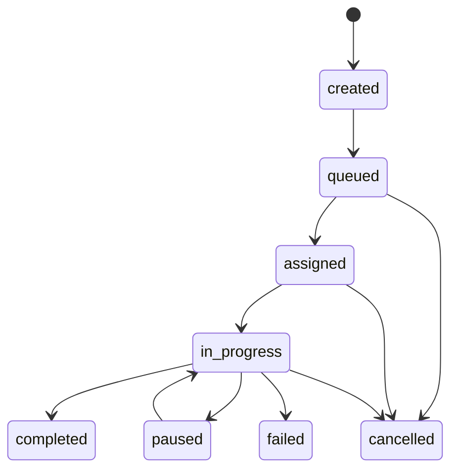
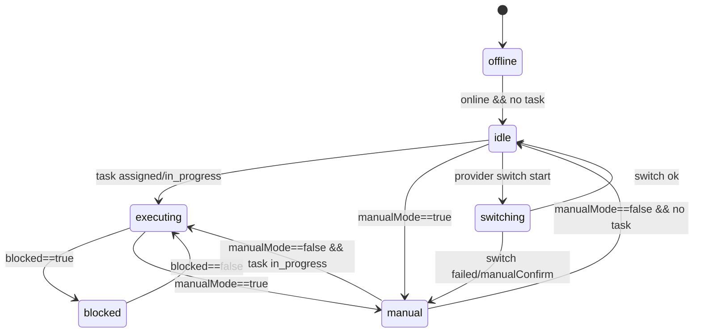
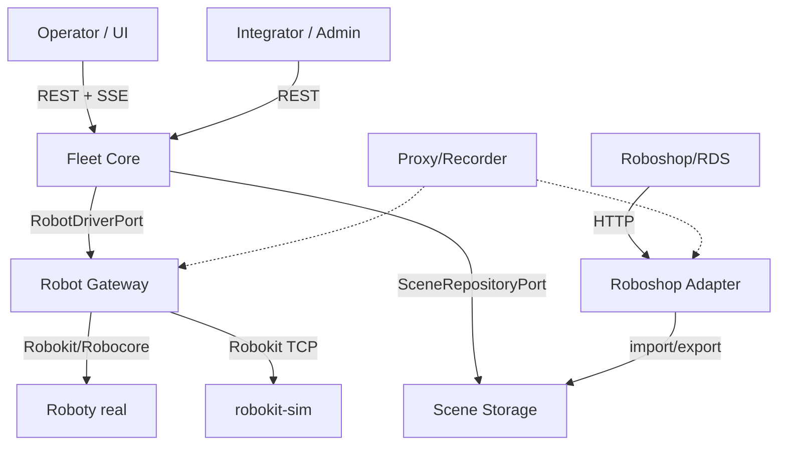
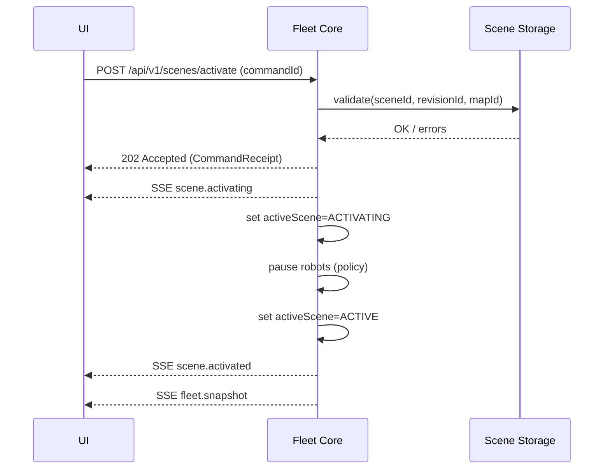
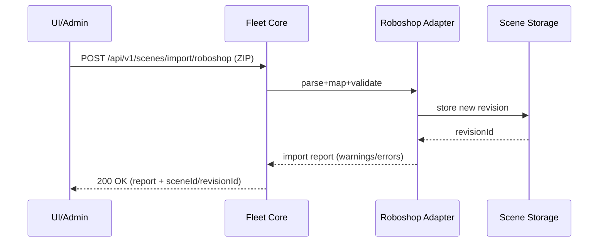
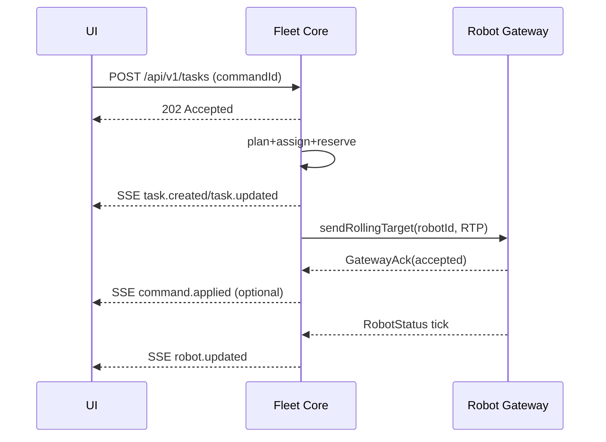
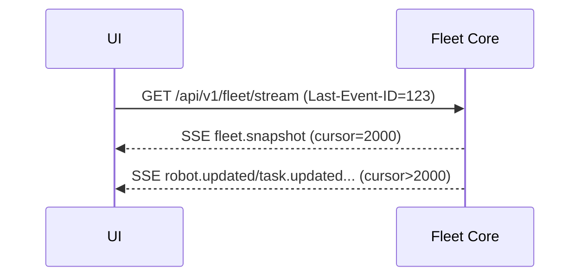
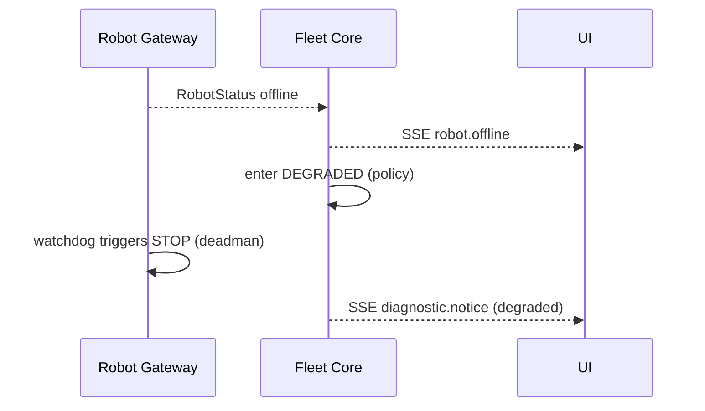

# Fleet Manager 2.0 — Specyfikacja architektury (v0.2) — draft

## Część 1 — Prompt użytkownika

```text
zallaczam projekt fleet managera, zapoznaj sie z nim i z dokumentacja. fleet manager to program do zarzadania autonomicznymi wozkami widlowymi. ten program nie dziala zbyt dobrze i chcialbym go przepisac. ale podoba mi sie ui. chodzi mi o to, zeby przygotowac konspekt dokumentu specyfikacji calego projektu. projekt powienien byc bardzo modulowy tak, zeby mozna byo pracowac nad czesciami niezaleznie, porozumiewajac sie przez api. dzieki temu bedzie mogla nad tym efektywnie pracowac sztuczna inteligencja. proponuje takie moduly: interfejs uzytkownika, czyli frontend, ktory zajmuje sie wyswietlaniem mapy razem z wozkami i interakcja z uzytkownikiem. oraz da uzytkownikowi wglada jakie sa wozki, jaki jest stan pol odkladczych / odbiorczych. jakie sa zdefiniowane strumienie. jakie zadania wykonuja wozki. we frontendzie powinien byc kod potrzebny do obslugi interakcji z uzytkownikiem. jednak system powinien dzilac w zupelnisci bez wlaczonego frontendu. co wiecej powinno byc mozliwe kilka forntendow jednoczesnie. patrzacych na ten sam projekt. no tego powinien byc silnik nawigacyjny. ten silnik powinien wczytywac konfiguracje, zarzadac wozkami autonomicznymi. w tym silniku powinna byc mozliwosc wyboru algorytmu zarzadaania tymi wozkami. algorytm bedzie opracowanay w oddziwlnej specyfikacji. dodatkowo powinna byc mozliwosc dynamiczej zmiany mapy i konfiguracji. taka mapa z konfiguracja nazywamy scena. frontend powinine byc interfejsem do tego silnika. innym interfejscem powinien byc interfejs do roboshopa. czyli aplikacji zewnetrznej, ktora moze podgrywac mape. ale byc moze, zeby archtektura byla czytelniejsza to silnik powinien byec tylko api restowe. a ten interfejs do roboshopa powininen byc oddzialna aplikacja. do tego silnik powinien komunikowac sie z wozkami autonomicznymi. do tego tez jest interfejs robocore. jednak byc moze zarzadzaniem wozkami rowniez powinien zajmowac sie oddzielny program. i silnik z samym zarzadca wozkow, czyli same komendy tez powinny byc po rest api. a moze to nie jest dobry pomysl i lepiej zeby sillnik od razu korzystal z api roboshop? tak czy siek w silniku powinna byc mozliwosc symulacji robotow. i to by byla symulacja wewnetrzna. symulator powinein uwzgledniac wiele wozkow i mozliwe kolizja pomiedzy nimi. dodatkowo powinine byc symulator, korzystajacy z tych samych algorytmow symulacji robota, w sensie korzystajacy z api robokit. tak, zeby mozna byl przetestowac rozwiazania bez prawdziwego robota. no i na koniec powinna byc moliwosc przellaczenia na prawdziwego robota. to wszystko powinno mie elegancki design. latwy, prosty czytelny. latwy do zrozumienia i do pracy z AI. interfejsy powinny byc bardzo ladnie zrokumenowane. dodatkowo, warto zaznaczyc, ze robot powinien byc sterowany takim rolling target pointem. chodzi o to, zeby robot fizyczny dostawal cel ajko punkt odlegly przynajmniej o x metrow wzdluz trasy, ktora ma planner. robot ma swoja mape i planuje sobie lokalna trase. docelowo, wozek robot bedzie mogl zajmowac sie lokalnym omijaniem przezkod, to bedzie mozliwe, gdy bedzie mogl lokalnie planowac trase. jednak to dopiero w kolejnym kroku. oczywiscie omijanie przeszkod bedzie mozliwe tylko w niektorych miejscach mapy / grafu, tam gdzie szerokosc width jest ustawiona > 0. wiec na poczatek mozemy to pominac i zrobic algorytm, ktory zaklada ze nie ma omijania przeszkod. jedyne co musimy zapewnic to to, ze wiemy, ze wozek sie zablokowal oraz ze bedzie chcial wejsc w tryb omijania przezkod. ale wracajac do architektury, mamy jeszcze dodatkowa rzecz. to bedzie proxy pomiedzy programem roboshop do zarzadzania a fizycznym roboetem, zeby mozna bylo podsluchac protokoly. no i proxy pomiedzy roboshopem a rds'em czyli innym gotowym fleet managerem, gdzie przez roboshop mozna podgrywac mapy i robic konfiguracje. no ale to proxy to troche takie niezaezne oprogramowanie, ktore tylko powinno miec ustawienia co one podsluchuje, na ktorych portach i jakie sa adresy, oraz gdzie zapisuje, tak, zeby mozna bylo wygodnie podsluchiwac kompunikacj ep poiedzy roboshopem a roznymi robotami - w celu developmentu. no i tak, w tym domumencie bardzij chodzi mi o to, zeby opracowac overview calej architektury rozwiazania. ajkaie wszystkei proprojekty, jak powinein byc konfigurowany kazdy projekt. jakie dane. jak mozn a dynamicznie konfigurowac. jak zrobic zeby symulatoer wewnetrzny mial kilka robotow. ale rowniezm zeby w trakcie symulacji mozna bylo przelaczac jednego z robotow w projekcie na symulowanego przez protokol robocore, lub na prawdziwego robota. wszelkie interfejsy, wszystko co bedzie potrzebne do przyszlej implementacji. wszystko eleganckie, proste, odporne na bledy i na przerywy w komunikacji sieciowej. bedenralnie bardzo profesjonalne i bardzo wysokiej jakosci. przygotuj pierwsza wersje takiej specyfikacji, najbardziej obszerna jak sie da. opisz rowniez potencjalne pulapki, co sie moze nie udac, jakie sa ryzyka i jak je rozwiazac. gdybys mial inne propozycje to tez napisz. a moze tez zidentyfikowales jakis komponent. zastanow sie i przeslij bardoz obszerny dokument ajko odpowiedz
```

## Część 2 — Specyfikacja architektury (v0.2 / draft)

### Kontrola dokumentu

| Pole | Wartość |
|---|---|
| Dokument | Fleet Manager 2.0 — Specyfikacja architektury |
| Wersja | v0.2 |
| Status | Draft |
| Data | 2026-01-06 |
| Właściciel | TBD |
| Odbiorcy | Backend, Frontend, QA, DevOps, Architekt/Tech Lead |
| Zakres | Architektura systemu Fleet Manager (bez szczegółów algorytmu) |
| Dokumenty powiązane | `specyfikacja_algorytmu_fleet_manager_0.1.md`, `specyfikacja_ui_fleet_manager_v0_1.md`, `prototyp_fleet_manager_requirements_stare.md` |
| Zasada „nic nie ginie” | Oryginalna wersja v0.1 jest zarchiwizowana w sekcji **„Rzeczy usunięte / Archiwum v0.1”** na końcu pliku. |

### Changelog (v0.1 → v0.2)

Wersja v0.2 wprowadza (w skrócie):

1. Rozdzielenie **warstwy normatywnej** (wymagania/kontrakty) od **warstwy informacyjnej** (rationale, odniesienia do prototypu).  
2. Doprecyzowanie **semantyki recovery**: co jest persistowane, co po restarcie, jak unikamy „ghost commands”.  
3. Uszczelnienie **realtime (SSE)**: kolejność, `cursor`, `Last-Event-ID`, snapshoty, replay, backpressure, limity.  
4. Jednoznaczna polityka konfliktów **multi-frontend**: optimistic concurrency (ETag/If‑Match) + audit.  
5. Dedykowana sekcja **Security & Safety boundaries** (RBAC, audyt, tryby awaryjne, watchdog).  
6. „Operacyjność” dokumentu: **Deployment view**, tryby uruchomienia (bundle vs distributed), healthchecks, runbook.  
7. Uporządkowanie modelu danych: formalizacja **Scene/Runtime/History** + wersjonowanie/migracje + `sha256` zamiast `md5` w przykładach.  
8. Dodanie **kanonicznego modelu domeny** (encje + state machine + inwarianty) oraz **sequence diagrams** dla kluczowych przepływów.  
9. Uporządkowanie „open decisions” przez indeks ADR (Decision Log).

### Jak czytać ten dokument

#### Terminologia normatywna (RFC 2119)

Wymagania w tym dokumencie używają słów:

- **MUST** — wymaganie bezwzględne (implementacja nie jest zgodna bez tego).
- **MUST NOT** — zakaz bezwzględny.
- **SHOULD** — silna rekomendacja (odstępstwo wymaga uzasadnienia).
- **SHOULD NOT** — silnie odradzane.
- **MAY** — opcjonalne.

#### Warstwy dokumentu

- **Warstwa normatywna (contract/spec)**: sekcje 1–18. To jest „umowa”, którą implementacja musi spełnić.
- **Warstwa informacyjna (rationale/notes)**: załączniki (Appendix) + komentarze „dlaczego tak”.
- **Rzeczy usunięte / Archiwum v0.1**: pełna treść v0.1 (dla gwarancji, że nic nie zniknęło) + lista zmian/wycięć.

---

## Cel dokumentu (zwięzły opis)

Przygotować pierwszą, możliwie obszerną wersję dokumentu specyfikacji/overview architektury nowego Fleet Managera (systemu zarządzania autonomicznymi wózkami widłowymi), zaprojektowanego modułowo tak, aby poszczególne części mogły być rozwijane niezależnie i komunikowały się przez dobrze zdefiniowane API. Dokument ma opisać moduły, modele danych (w tym „Scenę”), interfejsy, tryby symulacji i pracy z robotami (symulacja wewnętrzna, symulacja przez Robokit/Robocore, roboty prawdziwe), a także ryzyka, pułapki i strategie ich ograniczania.

---

## 1. Zakres i ogólne założenia

### 1.1 Zakres

System **Fleet Manager 2.0** ma zarządzać flotą autonomicznych wózków (robotów) na mapie (grafie), planować/przydzielać zadania, koordynować ruch (traffic + rezerwacje), wysyłać komendy sterujące do robotów (przez Robot Gateway), oraz dostarczać UI spójny obraz stanu świata (snapshot + realtime events).

Ten dokument obejmuje:
- architekturę podziału na moduły/usługi,
- modele danych i kontrakty API,
- semantykę realtime i odporność na błędy,
- operacje/deployment (w stopniu niezbędnym do dowiezienia MVP i bezpiecznego utrzymania),
- testowalność i „AI-readiness” (kontrakty jako kod, golden fixtures, replay).

Ten dokument **nie** obejmuje szczegółów algorytmu planowania i przydziału (są w osobnym dokumencie).

### 1.2 Non-goals (na etap v0.x)

- System **nie** dostarcza certyfikacji bezpieczeństwa przemysłowego (SIL/PL) — ale **MUST** mieć interfejsy/guardrails ułatwiające integrację z safety (E‑Stop, strefy zakazane, limity).
- System **nie** implementuje docelowego local obstacle avoidance na robocie (może jedynie sygnalizować potrzeby i przygotować kontrakty).
- System **nie** jest od razu multi-tenant / multi-site (chyba że zostanie jawnie dodane w ADR).

---

## 2. Słownik pojęć (terminy domenowe)

- **Scene (Scena)**: komplet danych potrzebnych do uruchomienia floty: mapa/graf + workflow/streamy + konfiguracja robotów + parametry algorytmów + artefakty pomocnicze.
- **Scene Revision**: immutable wersja sceny (np. wynik importu lub edycji), możliwa do aktywacji.
- **Runtime state**: stan zmienny w czasie (tasks, occupancy, reservations, obstacles, itp.) — nie jest częścią Scene Revision.
- **History/Audit**: append-only historia zdarzeń/operacji (kto/co/kiedy), dumpy diagnostyczne, logi sesji.
- **Map / Graph**: graf nawigacyjny (węzły, krawędzie, geometria, kierunkowość, szerokość).
- **Worksite**: punkt logiczny pick/drop (lokalizacje binów, grupy, occupancy `empty/filled`, `blocked`).
- **Stream**: strumień pracy (np. dostawa opakowań), definiuje reguły generowania zadań.
- **Task**: zadanie robota (typowo pick→drop + akcje).
- **Fleet Core**: serce systemu; planuje, przydziela, rezerwuje, publikuje eventy, wysyła intencje/komendy.
- **Robot Gateway**: warstwa integracyjna do robotów (protokoły, retry/breaker, status mapping, provider switching).
- **Robot Provider**: źródło „prawdy” o robocie i kanał komend (np. `internal_sim`, `robokit_sim`, `robokit_real`).
- **Rolling Target Point (RTP)**: sterowanie przez punkt celu „toczący się” po trasie w odległości ≥ `lookaheadM`.
- **Reservation**: czasowa rezerwacja zasobu (node/corridor/critical section) na potrzeby koordynacji ruchu.
- **Cursor**: monotoniczny identyfikator zdarzenia realtime (do resume/replay).

---

## 3. Wymagania funkcjonalne (MUST/SHOULD/MAY)

### 3.1 UI (frontend)

UI jest „thin clientem”.

UI / API musi umożliwiać:

- UI **MUST** renderować mapę/graf i stan robotów (pozycje, trasy, statusy).
- UI **MUST** wyświetlać aktualny stan: roboty, tasks, worksites, active scene, alarmy/awarie.
- UI **MUST** pozwalać wykonywać podstawowe akcje operatorskie:
  - aktywacja sceny,
  - ustawianie occupancy/blocked worksites,
  - ręczne tworzenie/anulowanie tasków,
  - komendy robota: go-target/go-point/RTP/pause/resume/stop (w zależności od trybu).
- UI **MUST** działać w trybie „multi-frontend”: 0..N klientów jednocześnie, każdy z poprawnym obrazem stanu (snapshot + events).
- UI **SHOULD** pokazywać status komend jako „pending → applied/failed” na podstawie `commandId` i eventów.
- UI **SHOULD** potrafić wznowić realtime po reconnect (SSE resume) bez „rozjechanego stanu”.

### 3.2 Fleet Core

Fleet Core musi zapewniać:

- **Scene lifecycle**
  - Core **MUST** obsłużyć przechowywanie i aktywację Scene Revision.
  - Core **MUST** wystawiać snapshot aktualnego świata (`/fleet/state`) + strumień eventów (`/fleet/stream`).
  - Core **MUST** rozróżniać dane `scene/` (immutable) vs `runtime/` (mutable) vs `history/` (append-only).

- **Task & work management**
  - Core **MUST** przechowywać i zarządzać taskami (tworzenie, assign, progress, cancel/pause/resume).
  - Core **MUST** utrzymywać stan worksites (occupancy, blocked) z kontrolą konfliktów (ETag/If‑Match).
  - Core **SHOULD** wspierać streamy generujące taski (może być etapowane).

- **Traffic + dispatch**
  - Core **MUST** potrafić planować trasę po grafie oraz koordynować konflikty (min. przez locki/rezerwacje).
  - Core **MUST** generować i wysyłać komendy sterowania do robotów przez Robot Gateway.
  - Core **MUST** wspierać RTP jako główny mechanizm sterowania ruchem (tam gdzie provider/capabilities na to pozwala).
  - Core **MUST** wykrywać sytuacje `blocked/stuck` i publikować je w stanie oraz eventach.

- **Provider switching**
  - Core **MUST** umożliwić przełączanie providera per robot (z transakcyjną procedurą i stanami przejściowymi).

### 3.3 Integracje

- **Roboty (Robokit/Robocore + symulacje)**
  - System **MUST** obsługiwać co najmniej: `internal_sim` oraz `robokit_*` przez Robot Gateway.
  - Robot Gateway **MUST** mapować statusy/protokoły na kanoniczny `RobotStatus`.

- **Roboshop/RDS**
  - System **SHOULD** umożliwić import scen z Roboshop/RDS (ZIP) przez dedykowany adapter (nie w Core).

- **Proxy/Recorder**
  - System **SHOULD** mieć komponent proxy/rekorder do podsłuchu i replay protokołów (dev/test).

---

## 4. Wymagania niefunkcjonalne (kluczowe dla jakości)

### 4.1 NFR — wymagania

1. **Deterministyczność** (szczególnie w symulacji i plannerze):
   - Symulacja **MUST** być deterministyczna przy danym seed + input events (replay).
2. **Kontrakty i wersjonowanie API**:
   - Public API **MUST** być wersjonowane (`/api/v1/...`) i opisane w OpenAPI.
   - Modele danych **MUST** mieć formalne schemy (JSON Schema) i przykłady.
3. **Odporność na błędy**:
   - System **MUST** definiować retry/timeout/breaker i politykę recovery po restarcie.
   - Komendy **MUST** być odporne na duplikaty (`commandId`) i konflikty (ETag/If‑Match).
4. **Obserwowalność**:
   - System **MUST** emitować structured logs, metryki i korelację (`traceId`, `commandId`).
   - System **MUST** udostępniać diagnostykę runtime + snapshot dump.
5. **Bezpieczeństwo operacyjne (security/safety)**:
   - System **MUST** mieć minimalne RBAC + audit log (kto/co/kiedy).
   - System **MUST** wspierać tryby awaryjne i watchdog (deadman timer) przez Gateway.

### 4.2 SLO (proponowane wartości startowe do walidacji)

Poniższe wartości są **propozycją startową** do walidacji w realnym środowisku (LAN + real roboty). Ich celem jest wymuszenie myślenia operacyjnego i testowalności.

| Obszar | SLO / cel (startowy) | Uwagi |
|---|---|---|
| Latencja eventów UI (SSE) | p95 < 250 ms | mierzone Core→UI w LAN |
| Stabilność ticka w `internal_sim` | jitter < 10% tickMs | dla tickMs 100–200 ms |
| Recovery po restarcie Core | < 30 s do stanu „DEGRADED + resync” | pełne RUNNING zależy od providerów |
| Switch provider (happy path) | p95 < 5 s | jeśli provider wspiera relocate |
| Utrata eventów SSE | < 0.1% przy reconnect | dopuszczalne duplikaty (at-least-once) |
| Skala MVP | 5–50 robotów, 1–10 UI | do potwierdzenia w ADR i testach |

---

## 5. Model domeny (kanoniczne encje + stany + inwarianty)

### 5.1 Kanoniczne encje

Poniżej minimalny „wspólny język” (domain model) — wszystkie moduły i kontrakty powinny się do niego odnosić.

#### 5.1.1 Robot

Robot jest identyfikowany przez `robotId` i ma parametry modelu:

- `robotId: string` (unikalny w obrębie sceny/systemu)
- `robotModelId: string` (typ wózka; footprint, limity, kinematyka)
- `providerMode: "internal_sim" | "robokit_sim" | "robokit_real"`
- `capabilities: { supportsRtp: boolean, supportsRelocate: boolean, ... }`
- `flags: { manualMode, pausedByCore, emergencyStop, blocked, wantsAvoidance }`
- `pose: { x, y, angle }` (metry + radiany, w układzie mapy)
- `task: { taskId, status, phase } | null`

#### 5.1.2 Task

- `taskId: string`
- `kind: string` (np. `pickdrop`, `goto`, `park`, …)
- `status: "created"|"queued"|"assigned"|"in_progress"|"paused"|"completed"|"failed"|"cancelled"`
- `assignedRobotId: string|null`
- `pickId/dropId/targetId` (zależnie od kind)
- `meta: object` (opcjonalne)
- `timestamps: createdAt, updatedAt, startedAt?, finishedAt?`

#### 5.1.3 Worksite

- `worksiteId: string`
- `nodeId: string` (referencja do map/graph)
- `groupId: string?`
- `state: { occupancy: "empty"|"filled", blocked: boolean }`
- `version: integer` (do optimistic concurrency)

#### 5.1.4 Scene / Runtime / History

- **Scene Revision** (immutable): mapa/graf + konfiguracje + defaults.
- **Runtime** (mutable): tasks, reservations, worksite state, provider assignments, itp.
- **History/Audit** (append-only): log akcji operatorskich, log komend i ich wyników, dumpy diagnostyczne, replay.

### 5.2 State machine

Poniższe state machine są minimalne i służą do ujednoznacznienia UI i logiki.

#### 5.2.1 Task state machine



#### 5.2.2 Robot „primary state” (uproszczone)

Robot ma kilka ortogonalnych flag (online/offline, manual, blocked). Dla UI upraszczamy do jednej etykiety:



### 5.3 Inwarianty (MUST zawsze prawdziwe)

- System **MUST** mieć dokładnie jedną aktywną scenę na instancję Fleet Core.
- Event stream **MUST** być uporządkowany (rosnący `cursor`) w obrębie jednego `bootId`.
- `commandId` **MUST** być unikalny per klient (UI) i per typ komendy (zalecane UUIDv4).
- Robot **MUST NOT** mieć dwóch aktywnych tasków jednocześnie.
- Task w stanie `in_progress` **MUST** mieć `assignedRobotId`.
- Provider switch **MUST** przejść przez stan `paused` zanim zacznie wysyłać nowe komendy ruchu.
- Zasób rezerwacji **MUST NOT** być przydzielony dwóm robotom w kolidujących przedziałach czasu (dla profilu rezerwacji).
- Domain layer **MUST NOT** importować adapterów integracyjnych (Robokit/Roboshop/IO) — tylko porty.

---

## 6. Architektura docelowa — widok z lotu ptaka (C4 + deployment view)

### 6.1 Podział na moduły/usługi (kanoniczny)

Kanoniczne komponenty:

1. **Fleet Core**  
   Odpowiada za domenę: scene lifecycle, state, tasks, dispatch, traffic, event stream.

2. **Robot Gateway**  
   Odpowiada za integracje z robotami: protokoły, retry/breaker, mapping statusów, provider switching.

3. **Scene Storage**  
   Repozytorium scen (FS/S3/DB) + wersjonowanie rewizji.

4. **Roboshop Adapter**  
   Import/export scen z/do Roboshop/RDS.

5. **Internal Simulator**  
   Provider robota dla `internal_sim` (deterministyczny multi-robot).

6. **Proxy/Recorder** (opcjonalnie, dev/test)  
   Podsłuch i replay protokołów.

### 6.2 Tryby uruchomienia (Mode A / Mode B)

Aby ograniczyć ryzyko „nadmiernego mikroserwisowania”, system definiuje dwa tryby:

- **Mode A (dev/bundle)** — wszystko w jednym procesie:
  - łatwy debug,
  - wspólna pamięć,
  - brak kosztów sieciowych,
  - te same kontrakty publiczne.
- **Mode B (prod/distributed)** — minimum dwa procesy:
  - Fleet Core osobno,
  - Robot Gateway osobno,
  - reszta opcjonalnie osobno.

W obu trybach:
- public API **MUST** być identyczne (to samo OpenAPI),
- modele danych **MUST** być identyczne (te same schemy),
- semantyka eventów **MUST** być identyczna (cursor/ordering).

### 6.3 System Context (C4 — kontekst)



### 6.4 Granice modułów (ports & adapters)

Zalecany podział warstw:

- **Domain**: czysta logika (task, traffic, reservations, rules).
- **Application**: use-case’y (activate scene, dispatch task).
- **Ports**: interfejsy do świata (RobotDriverPort, SceneRepositoryPort, EventBusPort).
- **Adapters**: Robokit, Roboshop, HTTP API, storage FS/DB.

Reguły:
- Domain **MUST NOT** znać protokołów/HTTP/FS.
- Adapters **MUST NOT** zawierać logiki domenowej (poza mapowaniem i retry).

---

### 6.5 Deployment i środowiska (operacyjność)

#### Zasada „single-writer”
- Fleet Core **MUST** być *jedynym pisarzem* (single-writer) dla stanu domenowego `runtime` w danej instancji (aktywny leader).
- Skalowanie horyzontalne Core (active-active) **MAY** być dodane później, ale wymaga ADR (leader election + shared storage + spójny cursor). Na etap v0.x zakładamy **jedną** instancję Core jako leader.

#### Środowiska
- `dev` (lokalne): Mode A (bundle) lub Mode B (2 procesy) — szybki feedback.
- `staging` (integracyjne): Mode B + robokit-sim + testy kontraktowe i integracyjne.
- `prod`: Mode B (min. Core + Gateway) + real roboty.

#### Konfiguracja (config/secrets)
- System **MUST** mieć jednolity mechanizm konfiguracji (env vars + opcjonalnie plik).
- Konfiguracja **MUST** rozróżniać:
  - *static config* (tylko restart): porty, ścieżki storage, auth, timeouts,
  - *runtime config* (bez restartu): część parametrów algorytmów, limity, policy flags.
- Sekrety (tokeny, hasła) **MUST NOT** trafiać do logów ani dumpów diagnostycznych (maskowanie).

Przykładowe grupy parametrów (nazwy poglądowe):
- `FM_CORE_HTTP_PORT`, `FM_GATEWAY_HTTP_PORT`
- `FM_SCENE_STORE_PATH` lub `FM_SCENE_STORE_S3_BUCKET`
- `FM_AUTH_MODE=none|token|oauth`
- `FM_SSE_REPLAY_BUFFER_EVENTS`, `FM_SSE_MAX_CLIENTS`
- `FM_GATEWAY_DEADMAN_TIMEOUT_MS`, `FM_GATEWAY_RETRY_POLICY`

#### Endpointy health i metryki
- Każdy proces (Core/Gateway/Adapter) **MUST** wystawiać:
  - `GET /healthz` — liveness (proces żyje, nie blokuje się),
  - `GET /readyz` — readiness (gotowy do obsługi; np. Core ma wczytany config i storage dostępny),
  - `GET /metrics` — metryki (np. Prometheus), co najmniej: request latency, error rate, robot online/offline, breaker state.
- Healthchecki **SHOULD** być użyte w orchestration (systemd/k8s/docker compose).

#### Graceful shutdown
- Core/Gateway **SHOULD** wspierać graceful shutdown:
  - przestają przyjmować nowe komendy,
  - emitują event `diagnostic.notice` o przejściu w shutdown,
  - zamykają połączenia i flushują audit log.

### 6.6 Runbook (minimum operacyjne)

To nie jest pełny manual, ale minimalny zestaw kroków, który ratuje życie na produkcji.

- **„UI pokazuje DEGRADED”**
  1. Sprawdź `/readyz` i `/metrics` (Core i Gateway).
  2. Sprawdź czy roboty raportują `online=false` (SSE: `robot.offline`).
  3. Wykonaj `POST /api/v1/diagnostics/dump` i zachowaj artefakt.

- **„Robot nie reaguje / jest BLOCKED”**
  1. Sprawdź `RobotStatus.details.blockedReason`.
  2. Jeśli `collision/obstacle`: usuń/przenieś przeszkodę, albo pause/resume task.
  3. Jeśli `traffic`: sprawdź reservations/wait graph w `/diagnostics`.

- **„Switch provider failed”**
  1. Robot pozostaje `paused` (MUST).
  2. Wymuś `manualConfirm` lub `relocate` zależnie od capability.
  3. Dopiero potem `resume`.

- **„Aktywacja sceny nie działa”**
  1. Sprawdź raport walidacji importu i błędy.
  2. Nie wznawiaj ruchu dopóki `scene.activated` nie jest `ACTIVE`.

- **„SSE rozłącza się często”**
  1. Sprawdź `FM_SSE_MAX_CLIENTS`, rozmiary eventów i backpressure.
  2. UI powinno robić resync (snapshot) po reconnect.

---

## 7. Kontrakty i wersjonowanie (Spec-as-code)

### 7.1 Single source of truth

Repozytorium **SHOULD** zawierać foldery:

- `contracts/openapi/fleet-core.v1.yaml`
- `contracts/schemas/*.schema.json`
- `contracts/examples/*.json`
- `adr/*.md` (Decision Log)

Implementacja **MUST** być walidowana testami kontraktowymi w CI (contract tests).

### 7.2 Polityka kompatybilności API

- `/api/v1` jest kanoniczne.
- Zmiana pola:
  - dodanie pola opcjonalnego = backward compatible,
  - usunięcie/zmiana typu pola = breaking change (wymaga v2 lub compat layer).
- Jeśli istnieje kompatybilność z dawnym UI, może istnieć `compat layer`:
  - `/api/*` aliasy mapowane na `/api/v1/*`,
  - compat **SHOULD** mieć osobne testy i deadline usunięcia (ADR).

### 7.3 Scene schema versioning i migracje

- `manifest.json` **MUST** zawierać `sceneSchemaVersion` (integer) oraz `sceneId/revisionId`.
- Migracje scen:
  - system **MUST** wspierać migracje jednostronne (stare → nowe),
  - narzędzie `scene-migrate` **SHOULD** istnieć, jeśli format będzie ewoluował.

---

## 8. API publiczne (UI ↔ Fleet Core)

### 8.1 Zasady API (MUST)

- API **MUST** być stateless na poziomie HTTP (stan w storage/runtime).
- Każde żądanie **SHOULD** mieć `X-Request-Id`; serwer generuje jeśli brak.
- Każda akcja operatorska/komenda **MUST** mieć `commandId` i trafiać do audit log.
- Zasoby mutowalne (worksites, settings) **MUST** wspierać optimistic concurrency:
  - `GET` zwraca `ETag`,
  - `PATCH/POST` wymaga `If-Match` (lub jawnego `version` w body).
- Odpowiedzi błędów **MUST** mieć stabilny model:
  ```json
  { "error": { "code": "version_conflict", "message": "...", "details": {...}, "traceId": "..." } }
  ```

### 8.2 Endpointy — minimalny zestaw (zachowuje sens obecnego UI)

#### 8.2.1 Scenes

- `GET /api/v1/scenes`
- `GET /api/v1/scenes/{sceneId}`
- `GET /api/v1/scenes/active`
- `POST /api/v1/scenes/activate`
  - body: `{ "sceneId": "...", "revisionId": "...", "mapId": "...", "commandId": "..." }`
- `POST /api/v1/scenes/import/roboshop` (ZIP → nowa rewizja)
- `GET /api/v1/scenes/{sceneId}/export` (opcjonalnie)

#### 8.2.2 Scene artifacts (map/graph/workflow)

- `GET /api/v1/scenes/active/map`
- `GET /api/v1/scenes/active/workflow`
- `GET /api/v1/scenes/active/robots-config`
- `GET /api/v1/scenes/active/packaging-config`

#### 8.2.3 Fleet state + stream

- `GET /api/v1/fleet/state` (snapshot)
- `GET /api/v1/fleet/stream` (SSE realtime — szczegóły w sekcji 9)

Przykładowy kształt `fleet/state`:

```json
{
  "tickMs": 140,
  "lastTickAt": 1736160000000,
  "robots": [ /* RobotStatus[] */ ],
  "worksites": [ /* Worksite[] */ ],
  "tasks": [ /* Task[] */ ],
  "obstacles": [ /* optional */ ],
  "activeScene": { "sceneId": "...", "revisionId": "...", "mapId": "..." }
}
```

#### 8.2.4 Worksites

- `GET /api/v1/worksites`
- `PATCH /api/v1/worksites/{id}`
  - body: `{ "filled": true|false, "blocked": true|false, "version": 12, "commandId": "..." }`  
  - lub `If-Match` zamiast `version`.

#### 8.2.5 Tasks

- `GET /api/v1/tasks?status=...&robotId=...`
- `POST /api/v1/tasks` (manual task)
  - body: `{ "kind": "pickdrop", "pickId": "...", "dropId": "...", "streamId": "...", "meta": {...}, "commandId": "..." }`
- `POST /api/v1/tasks/{taskId}/commands/cancel`
- `POST /api/v1/tasks/{taskId}/commands/pause` / `resume` (opcjonalnie)

#### 8.2.6 Robots (komendy użytkownika)

- `GET /api/v1/robots`
- `GET /api/v1/robots/{id}`
- `PATCH /api/v1/robots/{id}`
  - pola: `dispatchable`, `controlled`, `manualMode` (z optimistic concurrency)

Komendy jako „actions”:

- `POST /api/v1/robots/{id}/commands/go-target`
- `POST /api/v1/robots/{id}/commands/go-point`
- `POST /api/v1/robots/{id}/commands/motion`
- `POST /api/v1/robots/{id}/commands/pause` / `resume` / `cancel` / `stop`
- `POST /api/v1/robots/{id}/commands/rolling-target` *(jeśli wspierane)*

Każda komenda:
- **MUST** mieć `commandId`,
- **MUST** zwrócić `202 Accepted` + `CommandReceipt`,
- wynik wykonania jest obserwowany przez eventy (command applied/failed).

Przykład `CommandReceipt`:

```json
{
  "commandId": "b1f6c7d4-3a0d-4f0a-8b2d-1f3f7a9b2a10",
  "status": "accepted|rejected|duplicate",
  "reason": null,
  "traceId": "..."
}
```

#### 8.2.7 Obstacles (symulacja/test)

- `GET /api/v1/obstacles`
- `POST /api/v1/obstacles`
- `POST /api/v1/obstacles/clear`
- `DELETE /api/v1/obstacles/{id}`

#### 8.2.8 Algorithms catalog + settings

- `GET /api/v1/algorithms/catalog`
- `GET /api/v1/algorithms/settings`
- `PATCH /api/v1/algorithms/settings` (optimistic concurrency)

#### 8.2.9 Diagnostics

- `GET /api/v1/diagnostics?robotId=...&reservations=1&history=1...`
- `POST /api/v1/diagnostics/dump`

---

## 9. Realtime: Event stream (SSE) — semantyka, replay, snapshoty, limity

### 9.1 Kanoniczna ścieżka i format

- Kanoniczny endpoint realtime: **`GET /api/v1/fleet/stream`** (SSE).
- SSE **MUST** emitować eventy w rosnącym `cursor` (monotonic).

Sugerowany format envelope:

```json
{
  "cursor": 123456,
  "bootId": "2026-01-06T12:00:00Z__core-01",
  "ts": 1736160000123,
  "type": "robot.updated",
  "scene": { "sceneId": "...", "revisionId": "...", "mapId": "..." },
  "payload": { /* zależne od type */ },
  "schemaVersion": 1
}
```

### 9.2 Ordering, delivery, idempotency

- Eventy **MUST** być dostarczane w kolejności rosnącego `cursor` (dla pojedynczego połączenia).
- Po reconnect eventy **MAY** się powtórzyć (at-least-once). Klient **MUST** być idempotentny i ignorować duplikaty po `cursor`.
- `bootId` pozwala wykryć restart serwera; jeśli `bootId` się zmienił, klient **SHOULD** wykonać pełny resync (snapshot).

### 9.3 Resume / replay (Last-Event-ID)

- Klient **MAY** wysłać nagłówek `Last-Event-ID` (cursor ostatnio przetworzonego eventu).
- Serwer **SHOULD** spróbować kontynuować od `Last-Event-ID+1` jeśli ma bufor replay.
- Jeśli serwer nie ma eventów (za stary cursor), serwer **MUST** wymusić resync poprzez `fleet.snapshot` (patrz niżej).

### 9.4 Snapshoty

- Serwer **MUST** na nowym połączeniu wysłać event typu `fleet.snapshot` zawierający pełny stan świata oraz `cursor` konsystencji.
- Serwer **SHOULD** wysyłać okresowe snapshoty (np. co N sekund) albo wysłać snapshot na żądanie (parametr `?snapshot=1`), aby ograniczyć koszt resync.
- Snapshot **MUST** być „samowystarczalny” do odtworzenia UI (roboty, tasks, worksites, activeScene).

Przykład eventu `fleet.snapshot`:

```json
{
  "cursor": 2000,
  "bootId": "2026-01-06T12:00:00Z__core-01",
  "ts": 1736160002000,
  "type": "fleet.snapshot",
  "payload": {
    "fleetState": { /* jak GET /api/v1/fleet/state */ }
  },
  "schemaVersion": 1
}
```

### 9.5 Backpressure i limity

SSE jest podatne na „wolnego klienta”. Minimalne wymagania:

- Serwer **MUST** mieć limit:
  - maks. liczby klientów SSE,
  - maks. rozmiaru pojedynczego eventu,
  - maks. szybkości eventów (rate limit / batching).
- Serwer **SHOULD** utrzymywać ring buffer eventów (np. ostatnie N eventów lub M sekund).
- Jeśli klient jest zbyt wolny:
  - serwer **MAY** rozłączyć klienta (HTTP 429/close),
  - albo serwer **MAY** przejść w tryb „resync required” (emitując `fleet.resync_required` i snapshot).

### 9.6 Minimalny katalog typów eventów

Katalog startowy (rozszerzalny):

- `fleet.snapshot`
- `scene.activating` / `scene.activated` / `scene.activation_failed`
- `robot.updated` / `robot.offline` / `robot.blocked` / `robot.switching_provider`
- `task.created` / `task.updated` / `task.completed` / `task.failed`
- `worksite.updated`
- `reservation.updated` (opcjonalnie)
- `diagnostic.notice` (opcjonalnie)
- `command.applied` / `command.failed` (zalecane do UI pending-state)

---

## 10. Model danych: Scene, Runtime, History (format, aktywacja, zmiany)

### 10.1 Scene — definicja

Scena jest „bundle’em” danych wymaganych do uruchomienia. Scene Revision jest immutable.

Struktura na dysku (propozycja — może być FS/S3/DB, ale struktura logiczna pozostaje):

```text
scenes/
  index.json
  <sceneId>/
    revisions/
      <revId>/
        manifest.json
        maps/
          <mapId>.smap            (opcjonalnie, źródło importu)
          <mapId>.graph.json      (znormalizowany format kanoniczny)
        workflow.json5
        robots.json
        packaging.json
        extras/...
runtime/
  active.json                  (referencja do aktywnej sceny + stan aktywacji)
  state.json                   (persistowany runtime state, minimalny)
history/
  audit.log.jsonl              (append-only)
  diagnostics/
    <timestamp>__dump.json
```

`index.json` trzyma:
- listę scen i rewizji,
- aktywną scenę i aktywną mapę.

### 10.2 manifest.json (przykład, v0.2)

```json
{
  "sceneSchemaVersion": 1,
  "sceneId": "nowy-styl",
  "revisionId": "2026-01-06T12-00-00Z__imported",
  "name": "Nowy Styl - floor A",
  "createdAt": "2026-01-06T12:00:00.000Z",
  "maps": [
    { "mapId": "map-1", "kind": "smap", "path": "maps/map-1.smap", "sha256": "...", "sizeBytes": 12345 },
    { "mapId": "map-1-graph", "kind": "graph", "path": "maps/map-1.graph.json", "sha256": "...", "sizeBytes": 67890 }
  ],
  "activeMapId": "map-1-graph",
  "artifacts": {
    "workflow": "workflow.json5",
    "robots": "robots.json",
    "packaging": "packaging.json"
  },
  "defaults": {
    "algorithmProfile": "default",
    "rollingTarget": { "lookaheadM": 3.0, "minUpdateMs": 200 }
  },
  "compat": {
    "source": "roboshop-uploadScene",
    "originalZipName": "upload_scene.zip"
  }
}
```

### 10.3 Runtime state — co NIE jest częścią sceny

Runtime obejmuje m.in.:
- `worksiteState`: occupancy/blocked w runtime,
- `obstacles`: przeszkody symulacyjne,
- `tasks`: aktywne i historia,
- `robotRuntime`: route, schedule, segmentIndex, blockedReason,
- `reservations`: rezerwacje czasu i locki,
- `providerAssignments`: bieżący provider per robot,
- `audit`: kto zmienił co.

**Persistencja (MUST vs MAY):**
- Core **MUST** persistować:
  - referencję do aktywnej sceny/revision,
  - tasks (co najmniej aktywne) + ich stan,
  - audit log działań operatorskich i komend.
- Core **MAY** persistować:
  - rezerwacje i pełen event log (opcjonalnie; przydatne do debug).
- Core **MAY** trzymać w RAM:
  - cache planów, obliczeń, tymczasowe struktury (z możliwością odtworzenia).

### 10.4 Activation transaction (Scene activation)

Aktywacja sceny jest procedurą atomową z widocznymi stanami:

- `VALIDATING` → `ACTIVATING` → `ACTIVE` lub `FAILED`

Wymagania:
- Aktywacja sceny **MUST** weryfikować spójność (workflow, worksites, roboty vs mapa).
- Aktywacja sceny **MUST** publikować eventy (`scene.activating`, `scene.activated`, `scene.activation_failed`).
- Na start aktywacja sceny **SHOULD** wymagać global pause robotów (bezpieczniej).

### 10.5 Dynamiczne zmiany: runtime patches vs new revision

- **Runtime patches** (MUST):
  - obstacles, block/unblock, occupancy,
  - nie zmieniają topologii grafu.
- **Scene revision activation** (MUST dla zmian topologii):
  - zmiana grafu/geometry,
  - wymaga procedury migracji: pause → migrate tasks/reservations → activate → resume.

---

## 11. API wewnętrzne: Fleet Core ↔ Robot Gateway

Celem jest stabilny kontrakt niezależny od Robokit.

### 11.1 RobotDriverPort (interfejs logiczny)

Minimalny zestaw metod (logicznie; transport jest tematem ADR):

- `connect(robotId, config) -> connectionState`
- `getStatus(robotId) -> RobotStatus`
- `sendRollingTarget(robotId, RollingTargetCommand) -> GatewayAck`
- `sendGoTarget(robotId, GoTargetCommand) -> GatewayAck`
- `sendGoPoint(robotId, GoPointCommand) -> GatewayAck`
- `pause/resume/cancel/stop(robotId) -> GatewayAck`
- `setManualMode(robotId, enabled) -> GatewayAck`
- `relocate(robotId, pose|stationId) -> GatewayAck` *(opcjonalnie, ale kluczowe dla switch)*

### 11.2 Semantyka ACK: accepted vs delivered vs executed

Aby uniknąć błędnych założeń, rozdzielamy:

- **Transport ACK**: „gateway przyjął żądanie”.
- **Protocol ACK**: „robot (lub robokit) potwierdził przyjęcie”.
- **World effect**: „robot faktycznie jedzie / stan się zmienił” (obserwowane przez status).

Wymagania:
- Gateway **MUST** zwracać `GatewayAck` przynajmniej dla Transport ACK.
- Gateway **SHOULD** zwracać informację o Protocol ACK, jeśli protokół na to pozwala.
- Fleet Core **MUST** traktować efekt w świecie jako obserwowalny w `RobotStatus` (nie w samym ACK).

Przykład `GatewayAck`:

```json
{
  "commandId": "...",
  "status": "accepted|rejected|duplicate|unsupported",
  "transportAck": true,
  "protocolAck": false,
  "reason": null,
  "ts": 1736160000000
}
```

### 11.3 RobotStatus (kanoniczny model)

```json
{
  "robotId": "RB-01",
  "ts": 1736160000000,
  "online": true,
  "pose": { "x": -149.25, "y": -47.17, "angle": 1.57 },
  "speed": 0.3,
  "battery": 82,
  "robotModelId": "forklift-v1",
  "providerMode": "robokit_real",
  "capabilities": { "supportsRtp": true, "supportsRelocate": true },
  "task": {
    "taskId": "T-123",
    "status": "in_progress|paused|completed|failed|cancelled|null",
    "phase": "drive|pick|drop|park|blocked|manual"
  },
  "flags": {
    "blocked": false,
    "wantsAvoidance": false,
    "emergencyStop": false,
    "manualMode": false
  },
  "details": {
    "blockedReason": "obstacle|collision|traffic|robot|unknown|null",
    "lastError": null
  }
}
```

### 11.4 Capability negotiation (future-proof)

- Provider **MUST** deklarować capabilities (np. `supportsRelocate`, `supportsRtp`, `supportsManualMode`).
- Fleet Core **MUST** dobierać strategię sterowania na podstawie capabilities (np. fallback RTP→go-point).

### 11.5 Provider per robot (hot‑swap) — Switch Contract (twarde reguły)

Switch providerów to procedura transakcyjna. Minimalny kontrakt:

**Warunki wstępne (MUST):**
- robot w stanie `paused` (Core wstrzymuje dispatch RTP),
- brak „aktywnych” komend ruchu w kolejce gateway (albo jawne anulowanie),
- znana i stabilna `pose` (freshness < threshold),
- zgodność mapy: `mapHash/sceneRevisionId/frameId` (patrz niżej).

**Walidacja mapy (MUST):**
- Scene Revision dostarcza `mapId` i hash (sha256) grafu.
- Provider **MUST** raportować `mapId`/`mapHash` jeśli to możliwe; jeśli nie, switch **MUST** przejść w `manualConfirm`.

**Strategie synchronizacji:**
- `relocate` (najlepsza): provider wspiera relocate i przyjmuje pose.
- `assume` (ryzykowne): tylko jeśli różnica pose < tolerancji i mapy zgodne.
- `manualConfirm`: operator potwierdza, że robot jest ustawiony w odpowiednim miejscu.

**Stany przejściowe (MUST):**
- `switching.pending` → `switching.syncing` → `switching.ready` lub `switching.failed`

**Rollback (MUST):**
- jeśli switch fail, robot pozostaje `paused` i wymaga interwencji operatora (nie wracamy automatycznie do RUNNING bez jawnej akcji).

Publiczne API (do uruchomienia switch) może być w Core jako:

- `POST /api/v1/robots/{id}/provider`

```json
{
  "mode": "internal_sim|robokit_sim|robokit_real",
  "connection": { "host": "10.0.0.12", "ports": { "cmd": 9000, "status": 9001 } },
  "sync": { "strategy": "relocate|assume|manualConfirm", "pose": { "x": 1.2, "y": 3.4, "angle": 0.1 } },
  "commandId": "..."
}
```

---

## 12. Silnik nawigacyjny i zarządzanie ruchem (Traffic)

Celem jest spiąć istniejące zachowania (z prototypu) w czystą specyfikację.

### 12.1 Czas i przedziały

- Czas w systemie: **TimeMs = integer (ms)**.
- Przedziały rezerwacji: **[start, end)** (start włącznie, end wyłącznie).

### 12.2 Pipeline planowania (zalecany)

1. Snapshot (stan świata): roboty + cele + worksites + obstacles + czas.
2. Intent: planner generuje route (lista segmentów).
3. Schedule: scheduler nadaje czasy segmentom (timing model).
4. Reservation proposal: generacja rezerwacji zasobów.
5. Transaction/Commit: repair/replan w razie konfliktów, commit w razie OK.
6. Dispatch: RTP/komendy do robotów.

### 12.3 Zasoby do rezerwacji (minimum)

- Node (wąskie gardła).
- Edge group / corridor.
- Critical section (max N robotów naraz).

### 12.4 Minimalne zachowanie na start

- Planner zakłada brak local avoidance.
- Jeśli robot nie postępuje → `blocked/stuck`.
- Jeśli robot sygnalizuje “avoidance needed” → Core publikuje `wantsAvoidance` i może przeplanować/czekać.

### 12.5 Parametryzacja (profil algorytmu)

Konfiguracja algorytmu:
- część sceny (defaults),
- nadpisywalna runtime.

Przykład:

```json
{
  "dispatch": { "strategy": "nearest" },
  "traffic": {
    "strategy": "pulse-mapf-avoid",
    "replanIntervalMs": 1200,
    "replanDistance": 0.8,
    "nodeLocks": true,
    "nodeLockRadius": 0.6,
    "reservationHorizonMs": 12000,
    "reservationStepMs": 400
  }
}
```

### 12.6 Minimalny kontrakt pluginowy dla algorytmów (future-proof)

Architektura **MUST** umożliwiać wymienialność algorytmu bez zależności od adapterów.

Minimalny kontrakt (na poziomie architektury):
- wejście: `WorldSnapshot` + `AlgorithmSettings`,
- wyjście: `DispatchPlan` / propozycje rezerwacji / eventy diagnostyczne,
- `AlgorithmApiVersion` + `AlgorithmCapabilities`.

Szczegóły logiki algorytmów są w osobnym dokumencie.

---

## 13. Rolling Target Point (RTP) — spec sterowania ruchem robota

### 13.1 Definicja

Robot dostaje punkt docelowy przesuwający się po globalnej trasie w odległości ≥ `lookaheadM`.

### 13.2 Kontrakt RollingTargetCommand

```json
{
  "commandId": "...",
  "robotId": "RB-01",
  "routeId": "R-987",
  "target": { "x": -150.1, "y": -46.9, "angle": 1.55 },
  "constraints": {
    "minLookaheadM": 3.0,
    "maxSpeedMps": 1.0,
    "allowBackward": false
  },
  "validUntilTs": 1736160000500,
  "meta": { "segmentIndex": 12, "progressM": 4.2 }
}
```

### 13.3 Algorytm wyznaczania RTP (proponowany)

1. Globalna trasa jako polilinia.
2. Projekcja pozycji robota na polilinię → `s` (odległość wzdłuż).
3. `s_target = s + lookaheadM`.
4. Interpolacja punktu na polilinii dla `s_target`.
5. Heading jako styczna do trasy (opcjonalnie).

### 13.4 Blocked/stuck detection (kontrakt)

Core **MUST** umieć jednoznacznie stwierdzić:
- brak postępu przez T sekund,
- odchylenie od trasy,
- nieosiągalność RTP.

Wtedy:
- `RobotStatus.flags.blocked = true`,
- `blockedReason = traffic|obstacle|collision|robot|unknown`,
- opcjonalnie `wantsAvoidance = true`.

---

## 14. Symulacja: wewnętrzna vs Robokit vs real

### 14.1 Wewnętrzny symulator (multi-robot)

Wymagania:
- obsługa N robotów,
- model ruchu (uproszczony, ale spójny),
- kolizje (overlap detection + reakcja),
- przeszkody (`block`/`avoid`),
- deterministyczność (seed + replay).

### 14.2 Robokit-sim / protokół

Cel: testy integracyjne protokołu bez real robota:
- retry,
- timeouts,
- status mapping,
- semantics komend.

### 14.3 Przełączanie robota w trakcie symulacji

- Procedury switch są w sekcji 11.5; symulacja **MUST** potrafić przejść przez te stany.

---

## 15. Roboshop / RDS integracja

### 15.1 Zasada

Roboshop Adapter jest osobny od Core.

- Core ma własny kanoniczny format Scene.
- Adapter:
  - przyjmuje ZIP,
  - mapuje do formatu Scene,
  - waliduje import,
  - zapisuje nową rewizję.

### 15.2 Walidacja importu (MUST)

- workflow points muszą istnieć w mapie,
- roboty muszą mieć sensowne initialPosition,
- `bindRobotMap` spójne,
- raport błędów i ostrzeżeń.

---

## 16. Proxy/Recorder (dev/test)

### 16.1 Funkcje

- TCP proxy (Robokit): log ramek, timestamp, rotacja logów.
- HTTP proxy (Roboshop/RDS): log request/response, zapisywanie ZIP.
- Konfiguracja: YAML/JSON, maskowanie danych wrażliwych.

### 16.2 Replay

- odtwarzanie zapisanej sesji jako upstream,
- regresje bez sprzętu.

---

## 17. Security & Safety boundaries (minimalne guardrails)

### 17.1 Role i uprawnienia (RBAC)

Minimalne role:

- `viewer` — tylko odczyt (state, stream, diagnostics bez danych wrażliwych)
- `operator` — komendy operacyjne (pause/resume, worksites, tasks)
- `admin` — aktywacja sceny, provider switch, konfiguracje globalne
- `service` — integracje/automaty (np. Roboshop adapter)

**MUST:** każda akcja mutująca stan wymaga roli `operator` lub wyższej.

### 17.2 Audit log

- System **MUST** logować:
  - kto (user/service), co, kiedy, z jakim `commandId`, wynik (accepted/failed).
- Audit **MUST** być append-only i przetrwać restart.

### 17.3 Safety policy (tryby i deadman timer)

- System **MUST** wspierać tryby:
  - `RUNNING`, `DEGRADED`, `PAUSED_GLOBAL`, `EMERGENCY_STOPPED`.
- Gateway **MUST** mieć watchdog/deadman timer:
  - jeśli brak odświeżeń sterowania przez X ms → wysyła STOP (lub przechodzi w safe state).
- Limity prędkości i strefy zakazane **SHOULD** być konfigurowalne (nawet jeśli enforcement jest po stronie robota/PLC).

---

## 18. Odporność na błędy, recovery, multi-frontend

### 18.1 Zasady komend

- każda komenda ma `commandId`,
- gateway deduplikuje (ostatnie commandId per robot),
- core nie zakłada sukcesu bez obserwacji (status/event).

### 18.2 Circuit breaker i retry

- retry na typowe błędy sieci (ECONNRESET, timeout),
- breaker: po N failure → open na T,
- healthcheck zamyka breaker.

### 18.3 Spójność stanu przy wielu frontendach

- Serwer jest jedynym źródłem prawdy.
- UI utrzymuje pending state po `commandId`.
- Mutacje zasobów wymagają optimistic concurrency (ETag/If‑Match).

### 18.4 Recovery po restarcie Core (MUST)

Po restarcie:

- Core **MUST** odtworzyć:
  - aktywną scenę,
  - tasks (min. aktywne),
  - audit log.
- Core **MUST** oznaczyć roboty jako `requires_resync` do czasu otrzymania świeżego `RobotStatus`.
- Core **MUST NOT** automatycznie wznawiać sterowania ruchem bez potwierdzenia, jeśli polityka safety tego wymaga (ADR).

### 18.5 Ghost commands — minimalna ochrona

- Core **SHOULD** prowadzić journal komend (append-only) per robot:
  - `commandId`, typ, ts, status.
- Gateway **MUST** deduplikuje komendy po `commandId`.
- UI **MUST** generować unikalne `commandId` (UUID).

---

## 19. Observability i diagnostyka

### 19.1 Minimalny standard

- każde żądanie ma `traceId`,
- każda komenda ma `commandId`,
- logi są structured (JSON).

### 19.2 Diagnostyka runtime

`GET /api/v1/diagnostics` zwraca:
- route + segmentIndex + schedule,
- locki, queue, reservations,
- obstacles,
- event log (ostatnie N),
- opcjonalnie wait graph.

### 19.3 Snapshot dump

`POST /api/v1/diagnostics/dump` zapisuje JSON:
- scene revision,
- runtime state,
- ostatnie eventy,
- konfigurację algorytmu.

To jest kluczowe do współpracy z AI („tu masz dump, napraw”).

---

## 20. Testy, weryfikacja, acceptance criteria

### 20.1 Testy kontraktowe (MUST)

- OpenAPI + JSON Schema.
- Contract tests w CI jako gate.

### 20.2 Testy domenowe (SHOULD)

- inwarianty mapy,
- inwarianty rezerwacji,
- fairness / brak starvation.

### 20.3 Testy sim vs robokit-sim (SHOULD)

Te same testy uruchamiane na:
- internal sim,
- robokit-sim.

### 20.4 Acceptance criteria per moduł (minimum)

#### Fleet Core — DONE gdy:

- [ ] wystawia `/api/v1/fleet/state` i `/api/v1/fleet/stream` zgodnie z semantyką cursor/snapshot,
- [ ] aktywacja sceny przechodzi przez stany i publikuje eventy,
- [ ] tasks i audit przetrwają restart (persist),
- [ ] konflikty worksites/settings rozwiązywane przez ETag/If‑Match,
- [ ] działa bez UI.

#### Robot Gateway — DONE gdy:

- [ ] mapuje statusy do `RobotStatus`,
- [ ] implementuje retry/breaker,
- [ ] deduplikuje komendy po `commandId`,
- [ ] ma watchdog/deadman timer,
- [ ] provider switch działa w kontrolowanej procedurze.

#### Internal Sim — DONE gdy:

- [ ] deterministyczny seed + replay,
- [ ] N robotów, kolizje, obstacles,
- [ ] konsumuje RTP.

#### Roboshop Adapter — DONE gdy:

- [ ] import ZIP → scene revision,
- [ ] walidacja i raport błędów,
- [ ] (opcjonalnie) export.

#### Proxy/Recorder — DONE gdy:

- [ ] record + rotacja logów,
- [ ] replay sesji (opcjonalnie).

---

## 21. Ryzyka i edge cases (z mitigacjami)

- Drift sim ≠ real → robokit-sim + replay real sessions.
- Provider switch → wymuszony `paused` + walidacja mapy + replan.
- Dynamiczna zmiana mapy → runtime patches vs revision activation + migration mode.
- Multi-operator konflikty → ETag/If‑Match + audit + UI.
- Mikroserwisy → Mode A/Mode B + kryteria rozdzielania (ADR).
- Brak formalnych kontraktów → contracts as code + testy w CI.
- Safety → deadman timer + stop now + logging safety events.

Dodatkowe edge case’y (SHOULD testować):
- robot offline w połowie tasku,
- reconnect UI podczas activation sceny,
- gateway offline przy aktywnym RTP,
- mismatch mapy przy switch (manualConfirm),
- przekroczenie limitu eventów SSE (backpressure),
- dwa UI wysyłają sprzeczne komendy (konflikty i audit).

---

## 22. Dodatkowe komponenty (opcjonalne, ale wysokiej wartości)

- Scenario Runner + Replay Harness (benchmarks algorytmu).
- Map Compiler / Validator (normalizacja grafu i walidacje).
- Event Sourcing (opcjonalnie; turbo do debug).
- Policy/Rules engine (oddzielenie reguł magazynowych od traffic).

---

## 23. Plan etapów (żeby to realnie dowieźć)

### Etap A — „Kontrakty i szkielet”
- OpenAPI `/api/v1/*`.
- SSE stream semantics + snapshot.
- Compat layer dla obecnego UI.

### Etap B — „Scene lifecycle”
- Scene storage + revisioning.
- Import Roboshop ZIP.
- Activation transaction + walidacja.

### Etap C — „Robot Gateway”
- RobotStatus + RobotDriverPort.
- Provider `robokit_*` + retry/breaker + watchdog.

### Etap D — „Internal multi-robot sim”
- ruch + collision + obstacles + determinism.

### Etap E — „Rolling Target Point”
- RTP w Core i providerach (fallback jeśli brak RTP).

### Etap F — „Traffic + reservations”
- scheduler + reservations + diagnostyka deadlock.

### AI work packages (dla ułatwienia pracy z AI)

- [ ] AI: wygeneruj OpenAPI dla `/scenes`, `/fleet`, `/robots`, `/tasks`, `/worksites`.
- [ ] AI: wygeneruj JSON Schema dla `SceneManifest`, `RobotStatus`, `Task`, `Worksite`, `EventEnvelope`.
- [ ] AI: wygeneruj przykłady payloadów (happy/error) do `contracts/examples`.
- [ ] AI: wygeneruj contract tests (schema validation) jako gate w CI.
- [ ] AI: przygotuj fixtures `fixtures/scenes/*` i `fixtures/replays/*`.

---

## 24. Decision Log (ADR index) + decyzje otwarte

W v0.2 zamykamy kluczowe rozjazdy poprzez ADR (krótkie dokumenty decyzji). Lista startowa:

| ADR | Temat | Status |
|---|---|---|
| ADR-001 | Transport Core↔Gateway (HTTP vs gRPC) | TBD |
| ADR-002 | Storage scen: FS vs DB vs S3 | TBD |
| ADR-003 | SSE vs WS (realtime) | Proposed: SSE |
| ADR-004 | Polityka recovery po restarcie (auto-resume vs manual) | TBD |
| ADR-005 | Safety policy (stop-now, deadman timer, strefy) | Proposed: minimal guardrails |
| ADR-006 | Granice procesów (Mode A/B, kiedy split) | Proposed: A dev, B prod |
| ADR-007 | Event log durability (ring buffer vs durable log) | TBD |

Decyzje z v0.1 (zachowane i doprecyzowane):
- Core nie powinien korzystać bezpośrednio z Roboshop API w pętli sterowania.
- Robotami zarządza Robot Gateway (integracje i retry).
- Core jako REST API + realtime (SSE).

---

## 25. Appendix: zgodność z obecnym UI (żeby zachować wygląd)

Obecne UI zakłada m.in. endpointy w stylu:
- `/api/scenes`, `/api/scenes/active`, `/api/scenes/activate`
- `/api/fleet/config`, `/api/fleet/state`, `/api/fleet/stream`, `/api/fleet/worksites`, `/api/fleet/robots/...`
- `/api/algorithms/catalog`
- `/api/sim/obstacles`, `/api/sim/settings`, `/api/sim/blocked`

Rekomendacja:
- `/api/v1/...` jest docelowe (kanoniczne),
- `compat layer` utrzymuje `/api/*` aliasy, żeby UI działało od razu,
- dopiero potem UI migrujemy na v1 (opcjonalnie).

---

## 26. Sequence diagrams (kluczowe przepływy)

Poniżej minimalne 6 przepływów, które specyfikacja wymaga mieć spójne (to są miejsca, gdzie systemy flot pękają).

### 26.1 Aktywacja sceny



### 26.2 Import sceny z Roboshop ZIP



### 26.3 Dispatch taska + RTP



### 26.4 Reconnect UI do SSE (resume)



### 26.5 Provider switch dla jednego robota

```mermaid
sequenceDiagram
  participant UI as UI/Admin
  participant Core as Fleet Core
  participant GW as Robot Gateway
  UI->>Core: POST /api/v1/robots/RB-01/provider (commandId)
  Core-->>UI: 202 Accepted
  Core->>GW: pause(RB-01)
  GW-->>Core: Ack(paused)
  Core-->>UI: SSE robot.switching_provider (pending)
  Core->>GW: switchProvider(mode, syncStrategy)
  GW-->>Core: Ack(ready/failed)
  alt switch ok
    Core->>Core: replan reservations for RB-01
    Core->>GW: resume(RB-01)
    Core-->>UI: SSE robot.switching_provider (ready)
  else switch failed
    Core-->>UI: SSE robot.switching_provider (failed; manualConfirm)
  end
```

### 26.6 Lost comms do robota



---

## 27. Rzeczy usunięte / zmienione (v0.1 → v0.2) + Archiwum v0.1

### 27.1 Usunięte / zmienione elementy

- Ujednolicono ścieżkę realtime do **`/api/v1/fleet/stream`** (wcześniej pojawiało się także `/api/v1/stream`).
- W przykładach `manifest.json` zmieniono hash `md5` → **`sha256`** (integrity).
- Dodano formalne rozróżnienie `scene/` vs `runtime/` vs `history/`.
- Repo-ścieżki i detale prototypu traktowane są jako informacyjne (Appendix); spec normatywna nie zależy od aktualnego layoutu repo.
- Doprecyzowano ACK i recovery (nie opieramy się na „idempotencja wszystko rozwiąże”).

### 27.2 Archiwum: pełna treść v0.1 (nie edytować)

````markdown
# Fleet Manager 2.0 — Specyfikacja architektury (v0.1) — materiał do recenzji

## Część 1 — Prompt użytkownika

```text
zallaczam projekt fleet managera, zapoznaj sie z nim i z dokumentacja. fleet manager to program do zarzadania autonomicznymi wozkami widlowymi. ten program nie dziala zbyt dobrze i chcialbym go przepisac. ale podoba mi sie ui. chodzi mi o to, zeby przygotowac konspekt dokumentu specyfikacji calego projektu. projekt powienien byc bardzo modulowy tak, zeby mozna byo pracowac nad czesciami niezaleznie, porozumiewajac sie przez api. dzieki temu bedzie mogla nad tym efektywnie pracowac sztuczna inteligencja. proponuje takie moduly: interfejs uzytkownika, czyli frontend, ktory zajmuje sie wyswietlaniem mapy razem z wozkami i interakcja z uzytkownikiem. oraz da uzytkownikowi wglada jakie sa wozki, jaki jest stan pol odkladczych / odbiorczych. jakie sa zdefiniowane strumienie. jakie zadania wykonuja wozki. we frontendzie powinien byc kod potrzebny do obslugi interakcji z uzytkownikiem. jednak system powinien dzilac w zupelnisci bez wlaczonego frontendu. co wiecej powinno byc mozliwe kilka forntendow jednoczesnie. patrzacych na ten sam projekt. no tego powinien byc silnik nawigacyjny. ten silnik powinien wczytywac konfiguracje, zarzadac wozkami autonomicznymi. w tym silniku powinna byc mozliwosc wyboru algorytmu zarzadaania tymi wozkami. algorytm bedzie opracowanay w oddziwlnej specyfikacji. dodatkowo powinna byc mozliwosc dynamiczej zmiany mapy i konfiguracji. taka mapa z konfiguracja nazywamy scena. frontend powinine byc interfejsem do tego silnika. innym interfejscem powinien byc interfejs do roboshopa. czyli aplikacji zewnetrznej, ktora moze podgrywac mape. ale byc moze, zeby archtektura byla czytelniejsza to silnik powinien byec tylko api restowe. a ten interfejs do roboshopa powininen byc oddzialna aplikacja. do tego silnik powinien komunikowac sie z wozkami autonomicznymi. do tego tez jest interfejs robocore. jednak byc moze zarzadzaniem wozkami rowniez powinien zajmowac sie oddzielny program. i silnik z samym zarzadca wozkow, czyli same komendy tez powinny byc po rest api. a moze to nie jest dobry pomysl i lepiej zeby sillnik od razu korzystal z api roboshop? tak czy siek w silniku powinna byc mozliwosc symulacji robotow. i to by byla symulacja wewnetrzna. symulator powinein uwzgledniac wiele wozkow i mozliwe kolizja pomiedzy nimi. dodatkowo powinine byc symulator, korzystajacy z tych samych algorytmow symulacji robota, w sensie korzystajacy z api robokit. tak, zeby mozna byl przetestowac rozwiazania bez prawdziwego robota. no i na koniec powinna byc moliwosc przellaczenia na prawdziwego robota. to wszystko powinno mie elegancki design. latwy, prosty czytelny. latwy do zrozumienia i do pracy z AI. interfejsy powinny byc bardzo ladnie zrokumenowane. dodatkowo, warto zaznaczyc, ze robot powinien byc sterowany takim rolling target pointem. chodzi o to, zeby robot fizyczny dostawal cel ajko punkt odlegly przynajmniej o x metrow wzdluz trasy, ktora ma planner. robot ma swoja mape i planuje sobie lokalna trase. docelowo, wozek robot bedzie mogl zajmowac sie lokalnym omijaniem przezkod, to bedzie mozliwe, gdy bedzie mogl lokalnie planowac trase. jednak to dopiero w kolejnym kroku. oczywiscie omijanie przeszkod bedzie mozliwe tylko w niektorych miejscach mapy / grafu, tam gdzie szerokosc width jest ustawiona > 0. wiec na poczatek mozemy to pominac i zrobic algorytm, ktory zaklada ze nie ma omijania przeszkod. jedyne co musimy zapewnic to to, ze wiemy, ze wozek sie zablokowal oraz ze bedzie chcial wejsc w tryb omijania przezkod. ale wracajac do architektury, mamy jeszcze dodatkowa rzecz. to bedzie proxy pomiedzy programem roboshop do zarzadzania a fizycznym roboetem, zeby mozna bylo podsluchac protokoly. no i proxy pomiedzy roboshopem a rds'em czyli innym gotowym fleet managerem, gdzie przez roboshop mozna podgrywac mapy i robic konfiguracje. no ale to proxy to troche takie niezaezne oprogramowanie, ktore tylko powinno miec ustawienia co one podsluchuje, na ktorych portach i jakie sa adresy, oraz gdzie zapisuje, tak, zeby mozna bylo wygodnie podsluchiwac kompunikacj ep poiedzy roboshopem a roznymi robotami - w celu developmentu. no i tak, w tym domumencie bardzij chodzi mi o to, zeby opracowac overview calej architektury rozwiazania. ajkaie wszystkei proprojekty, jak powinein byc konfigurowany kazdy projekt. jakie dane. jak mozn a dynamicznie konfigurowac. jak zrobic zeby symulatoer wewnetrzny mial kilka robotow. ale rowniezm zeby w trakcie symulacji mozna bylo przelaczac jednego z robotow w projekcie na symulowanego przez protokol robocore, lub na prawdziwego robota. wszelkie interfejsy, wszystko co bedzie potrzebne do przyszlej implementacji. wszystko eleganckie, proste, odporne na bledy i na przerywy w komunikacji sieciowej. bedenralnie bardzo profesjonalne i bardzo wysokiej jakosci. przygotuj pierwsza wersje takiej specyfikacji, najbardziej obszerna jak sie da. opisz rowniez potencjalne pulapki, co sie moze nie udac, jakie sa ryzyka i jak je rozwiazac. gdybys mial inne propozycje to tez napisz. a moze tez zidentyfikowales jakis komponent. zastanow sie i przeslij bardoz obszerny dokument ajko odpowiedz
```

## Cel dokumentu (zwięzły opis)

Przygotować pierwszą, możliwie obszerną wersję dokumentu specyfikacji/overview architektury nowego Fleet Managera (systemu zarządzania autonomicznymi wózkami widłowymi), zaprojektowanego modułowo tak, aby poszczególne części mogły być rozwijane niezależnie i komunikowały się przez dobrze zdefiniowane API. Dokument ma opisać moduły, modele danych (w tym „Scenę”), interfejsy, tryby symulacji i pracy z robotami (symulacja wewnętrzna, symulacja przez Robokit/Robocore, roboty prawdziwe), a także ryzyka, pułapki i strategie ich ograniczania.

---

## Część 2 — Odpowiedź (draft specyfikacji)

# Fleet Manager 2.0 — Specyfikacja architektury (v0.1 / draft)

**Data:** 2026‑01‑06  
**Cel dokumentu:** dać Ci kompletny, modularny “szkielet prawdy” (kontrakty, moduły, dane, API, ryzyka), żeby można było przepisywać system etapami, równolegle, z minimalnym tarciem między częściami — i żeby AI mogła efektywnie implementować moduły niezależnie, trzymając się stabilnych interfejsów.

---

## 0. Co już masz (z załączonego projektu) i co warto zachować

Z repozytorium, które załączyłeś, wynika kilka bardzo dobrych fundamentów:

- **UI, które Ci się podoba** jest w praktyce “thin clientem”:
  - `apps/traffic-lab/public/` (HTML/CSS/JS + SVG mapa + panele: robots/fields/bufory/streamy/sceny/zadania/diagnostyka/awarie).
  - UI gada z backendem po REST + SSE (`/api/fleet/*`, `/api/scenes/*`, `/api/algorithms/catalog`, `/api/sim/*`).
  - To jest super do zachowania: UI nie musi znać algorytmów ani symulacji, tylko renderuje i wysyła komendy.

- **Backendowa logika symulacji i “traffic”** jest już całkiem bogata:
  - `packages/sim-runtime/src/fleet_sim.js` ma: wielorobotowy runtime, taski, worksites, przeszkody (block/avoid), diagnostykę, event log, blokady, locki, queue, time reservations, etc.
  - To jest kopalnia zachowań i edge-case’ów, które warto *zachować jako wymagania* nawet jeśli kod przepisujesz.

- Masz też “narzędzia okołoprojektowe”, które świetnie pasują do Twoich wymagań:
  - `apps/robokit-proxy` — proxy do podsłuchu/rekordu protokołów.
  - `apps/robokit-sim` — prosty symulator Robokit TCP (single robot).
  - `apps/task-manager` (w dokumentacji) — koncepcja “fleet core” sterującego robotami przez Robokit.

Ten dokument proponuje architekturę, która **zachowuje UI i dotychczasowe kontrakty**, ale porządkuje system w moduły, które mogą być rozwijane niezależnie.

---

## 1. Założenia i cele projektowe

### 1.1 Cele nadrzędne
1. **Modułowość “AI‑friendly”**: każdy większy komponent ma:
   - jasno opisany zakres odpowiedzialności,
   - osobny kontrakt API (OpenAPI + JSON Schema),
   - testy kontraktowe i symulatory/moki.
2. **System działa bez frontendu**:
   - frontend jest tylko klientem,
   - można uruchomić 0, 1 lub N frontendów jednocześnie, obserwujących tę samą scenę i stan.
3. **Wspólna definicja “Sceny” (Scene)**:
   - scena = mapa + konfiguracja workflow/streamów + konfiguracja robotów + opcjonalnie packaging/bufory + parametry algorytmów.
   - sceny są wersjonowane i można je przełączać.
4. **Jeden system, wiele “źródeł robotów” per robot**:
   - robot może być: symulowany wewnętrznie, symulowany przez Robokit API, albo prawdziwy.
   - w trakcie działania można przełączyć pojedynczego robota na inne źródło (z kontrolowaną procedurą synchronizacji).
5. **Odporność na sieć**:
   - przerwy, timeouty, retry, circuit breaker, idempotencja komend, spójność stanu.

### 1.2 Non‑goals na ten etap (żeby się nie utopić)
- Nie projektujemy tu “docelowego local obstacle avoidance” w robocie (to ma być w kolejnym kroku).
- Nie robimy certyfikacji bezpieczeństwa przemysłowego — ale projektujemy tak, żeby integracja z mechanizmami safety była możliwa.

---

## 2. Słownik pojęć (terminy domenowe)

- **Scene (Scena)**: komplet danych potrzebnych do uruchomienia floty: mapa + workflow + roboty + parametry.
- **Map / Graph**: graf nawigacyjny (węzły AP/LM itp., krawędzie, geometria, kierunkowość, szerokość “width”).
- **Worksite**: punkt logiczny pick/drop (w repo: `bin_locations`, `groups`, occupancy `empty/filled`, `blocked`).
- **Stream**: strumień pracy (np. dostawa opakowań), definiuje reguły generowania zadań.
- **Task**: zadanie robota (typowo pick->drop + akcje).
- **Fleet Core / Engine**: serce systemu; planuje, przydziela, rezerwuje, wysyła komendy do robotów.
- **Robot Provider**: źródło “prawdy” o robocie i kanał komend:
  - `internal_sim`,
  - `robokit_sim` (Robokit API),
  - `robokit_real` (prawdziwy robot Robokit/Robocore).
- **Rolling Target Point (RTP)**: sterowanie przez punkt celu “toczący się” po trasie w odległości ≥ X metrów wzdłuż planu globalnego.
- **Width > 0**: odcinki/korytarze, gdzie kiedyś będzie można lokalnie omijać przeszkody. Na start: tylko sygnalizacja “robot chce wejść w avoidance”.

---

## 3. Architektura docelowa — widok z lotu ptaka

Najważniejsza decyzja architektoniczna: **hexagonal architecture + kontrakty**.

- W środku: *domena* (planowanie, zadania, sceny, rezerwacje, stan).
- Na zewnątrz: adaptery (Robokit, Roboshop, symulacja, storage, UI).

### 3.1 Proponowany podział na moduły/usługi

Minimalny zestaw usług (deployowalnych osobno), a jednocześnie możliwy do uruchomienia “w bundlu” w dev:

1. **Fleet Core API (Engine)** — *najważniejsze*
   - REST API do: scen, robotów, worksites, tasków, ustawień algorytmów
   - kanał realtime: SSE/WebSocket (zdarzenia i snapshoty)
   - orkiestracja: planner/scheduler/dispatcher + rezerwacje + kontrola RTP
2. **Robot Gateway (Robokit/Robocore Adapter)** — *izoluje protokoły i sieć*
   - utrzymuje połączenia, retry, circuit breaker
   - wystawia jednolite API “robot driver” dla Fleet Core
   - pozwala mieć różne providery per robot
3. **Internal Simulator** (może być częścią Fleet Core albo osobną usługą)
   - wielorobotowa symulacja, kolizje, przeszkody
   - zgodna semantycznie z realnymi komendami (przynajmniej na poziomie: “pozycja, stan, blokada”)
4. **Robokit Simulator** (osobna aplikacja dev/test)
   - emuluje Robokit TCP API (dziś w repo jako `apps/robokit-sim`)
   - docelowo: multi‑robot lub wiele instancji
5. **Roboshop Integration Adapter** (opcjonalnie osobna aplikacja)
   - potrafi przyjąć/udostępnić sceny w formacie Roboshop/RDS (uploadScene/downloadScene)
   - tłumaczy na wewnętrzny format Scene Service
6. **Proxy/Recorder Tools**
   - TCP proxy (Robokit) + HTTP proxy (Roboshop/RDS)
   - zapis pakietów/ramek, metadanych, opcjonalnie replay

### 3.2 Diagram zależności

```text
+-------------------+        REST/SSE        +--------------------------+
|  Frontend #1      | <--------------------> |  Fleet Core API (Engine) |
+-------------------+                        +-----------+--------------+
         ^                                                |
         | REST/SSE                                        | "Robot Driver" port
         v                                                v
+-------------------+                        +--------------------------+
|  Frontend #N      |                        |  Robot Gateway           |
+-------------------+                        +-----+----------+---------+
                                                  |          |
                                                  | Robokit   | Internal provider
                                                  v          v
                                         +--------------+   +------------------+
                                         | Real Robot   |   | Internal Sim     |
                                         | (Robokit)    |   | (multi-robot)    |
                                         +--------------+   +------------------+
                                                  ^
                                                  | Robokit API
                                         +------------------+
                                         | Robokit-Sim      |
                                         +------------------+

+-------------------+         HTTP           +--------------------------+
| Roboshop / RDS    | <--------------------> | Roboshop Adapter         |
+-------------------+                        +--------------------------+
                                                        |
                                                        v
                                              +------------------+
                                              | Scene storage    |
                                              +------------------+

+-------------------+
| Proxy/Recorder    |
+-------------------+  (podsłuch TCP/HTTP między dowolnymi stronami)
```

---

## 4. Najważniejsze wymagania funkcjonalne

### 4.1 UI (frontend)
- Render mapy (graf + geometria) i robotów w czasie rzeczywistym.
- Podgląd:
  - robotów (online/dispatchable/manual/blocked/battery/pose/task status),
  - worksites (empty/filled/blocked),
  - streamów (konfiguracja, aktywacje),
  - tasków (kolejka, w toku, zakończone),
  - scen (lista, aktywna, przełączanie).
- Interakcje:
  - ustawianie occupancy i blocked na worksites,
  - manual drive / go‑target / go‑point,
  - pauza/wznow/cancel tasku/nawigacji,
  - dodawanie przeszkód (block/avoid) w trybie symulacji,
  - przełączanie algorytmu i parametrów.
- Multi‑frontend:
  - równoległe akcje od wielu klientów → serwer rozstrzyga konflikty (idempotencja + walidacja + eventy).

### 4.2 Fleet Core
- Wczytywanie scen, aktywowanie, walidacja spójności.
- Utrzymywanie stanu runtime:
  - robots, tasks, worksites, obstacles, streams, reservations.
- Generowanie tasków ze streamów (np. packaging engine) + ręczne taski.
- Przydział robota do tasku (strategy: nearest/first/…).
- Planowanie trasy globalnej po grafie (na start: bez lokalnego omijania).
- “Traffic management”: unikanie konfliktów między robotami (rezerwacje / locki / kolejki).
- Sterowanie robotem przez **Rolling Target Point**.
- Detekcja “blocked/stuck” + sygnał “robot wants avoidance”.
- Możliwość symulacji wewnętrznej wielu robotów (kolizje).
- Możliwość przełączania providerów per robot w trakcie działania.

### 4.3 Integracje
- Robokit/Robocore:
  - stan robota, task status, komendy ruchu, pause/resume/cancel, ewentualnie relokalizacja.
- Roboshop:
  - upload/download scen/map/konfiguracji (w repo widoczne endpointy RDS/Roboshop).
- Proxy:
  - podsłuch i zapis komunikacji, łatwa konfiguracja portów, rotacja logów.

---

## 5. Wymagania niefunkcjonalne (kluczowe dla jakości)

1. **Deterministyczność** (szczególnie w symulacji i plannerze): możliwość replay.
2. **Kontrakty i wersjonowanie API**:
   - `/api/v1/...` + OpenAPI
   - kompatybilność wsteczna albo warstwa “compat”.
3. **Odporność na błędy**:
   - timeouty, retry, circuit breaker, odtwarzanie po restarcie,
   - idempotencja komend.
4. **Obserwowalność**:
   - structured logs, metrics, trace/correlationId,
   - endpointy diagnostyczne + snapshot dump.
5. **Bezpieczeństwo operacyjne**:
   - role/permissions (nawet proste),
   - audit log (kto zmienił worksite/scene/robot provider),
   - tryby “readonly” i “manual override”.

---

## 6. Granice modułów i repozytoriów

Żeby AI mogła pracować równolegle, trzeba rozdzielić “co jest prawdą” od “jak to uruchamiamy”.

### 6.1 Warstwy (zalecane)
- **Domain (pure)**: logika planowania, rezerwacji, tasków, stanu — bez sieci, bez plików.
- **Ports (interfaces)**:
  - `RobotDriverPort` (send target, read status, pause/resume, etc)
  - `SceneRepositoryPort` (load/save scenes)
  - `EventBusPort` (publish domain events)
  - `ClockPort` (czas: real lub manual)
- **Adapters**:
  - Robokit adapter, internal sim adapter, storage adapter, Roboshop adapter.
- **Apps**:
  - fleet-core-api server, robot-gateway server, roboshop-adapter server, proxy tool.

### 6.2 Zasada: API jako “twarda granica”
- Między UI ↔ Fleet Core: zawsze HTTP + SSE/WS.
- Między Fleet Core ↔ Robot Gateway: preferowane gRPC albo HTTP (zależy od stacku), ale *kontrakt musi być formalny*.
- W dev można uruchomić “bundle”, ale granice muszą pozostać.

---

## 7. Model danych: Scene i runtime

### 7.1 Scene — definicja
**Scene** ma być *wersjonowalna i przenośna*. Proponuję:

- Scene = **immutable** “revision” (np. `sceneId + revisionId`).
- Runtime state (occupancy, obstacles, tasks in progress) jest osobno.

#### 7.1.1 Struktura na dysku (propozycja)
```text
scenes/
  index.json
  <sceneId>/
    revisions/
      <revId>/
        manifest.json
        maps/
          <mapId>.smap   (opcjonalnie)
          <mapId>.graph.json (opcjonalnie, znormalizowany)
        workflow.json5
        robots.json
        packaging.json
        extras/...
```

`index.json` trzyma:
- listę scen i rewizji,
- aktywną scenę i aktywną mapę.

#### 7.1.2 manifest.json (przykład)
```json
{
  "sceneId": "nowy-styl",
  "revisionId": "2026-01-06T12-00-00Z__imported",
  "name": "Nowy Styl - floor A",
  "createdAt": "2026-01-06T12:00:00.000Z",
  "maps": [
    { "mapId": "map-1", "kind": "smap", "path": "maps/map-1.smap", "md5": "..." },
    { "mapId": "map-1-graph", "kind": "graph", "path": "maps/map-1.graph.json", "md5": "..." }
  ],
  "activeMapId": "map-1-graph",
  "artifacts": {
    "workflow": "workflow.json5",
    "robots": "robots.json",
    "packaging": "packaging.json"
  },
  "defaults": {
    "algorithmProfile": "default",
    "rollingTarget": { "lookaheadM": 3.0, "minUpdateMs": 200 }
  },
  "compat": {
    "source": "roboshop-uploadScene",
    "originalZipName": "upload_scene.zip"
  }
}
```

### 7.2 Runtime state — co NIE jest częścią sceny
- `worksiteState`: occupancy/blocked *w runtime* (chyba że “zapisz do sceny”).
- `obstacles`: przeszkody symulacyjne.
- `tasks`: aktywne i historia.
- `robotRuntime`: route, schedule, segmentIndex, blockedReason, etc.
- `reservations`: rezerwacje czasu i locki.

To pozwala:
- przełączać sceny bez przenoszenia “brudu runtime”,
- robić replay/diagnostykę.

---

## 8. API publiczne (UI ↔ Fleet Core)

### 8.1 Zasady API
- **Wersjonowanie**: `/api/v1/...`
- **Idempotencja komend**: każda komenda może mieć `commandId` (UUID) + `clientId`.
- **Wspólny format błędów**:
```json
{ "error": "invalid_payload", "message": "..." , "details": {...}, "traceId": "..." }
```
- **Optymistyczna kontrola wersji** dla zasobów edytowalnych:
  - `etag`/`version` w odpowiedzi
  - `If-Match` przy update

### 8.2 Realtime: Event stream vs snapshot
UI potrzebuje “żywego” widoku. Najczytelniej:

- **SSE**: `/api/v1/stream`  
  - wysyła *eventy* + co jakiś czas snapshot.
- Alternatywnie WebSocket, ale SSE jest prostsze (i masz to już w projekcie).

#### 8.2.1 Model zdarzeń (propozycja)
Każde zdarzenie:
```json
{
  "type": "robot.updated",
  "ts": 1736160000000,
  "seq": 12345,
  "sceneId": "nowy-styl",
  "payload": { ... }
}
```

Przykładowe typy:
- `scene.activated`
- `worksite.updated`
- `robot.updated`
- `robot.providerChanged`
- `task.created`
- `task.updated`
- `obstacle.added` / `obstacle.removed`
- `diagnostics.snapshotAvailable`

### 8.3 Endpointy — minimalny zestaw (zachowuje sens Twojego UI)

#### 8.3.1 Scenes
- `GET /api/v1/scenes`
  - list + active
- `GET /api/v1/scenes/{sceneId}`
- `GET /api/v1/scenes/active`
- `POST /api/v1/scenes/activate`
  - body: `{ "sceneId": "...", "mapId": "..." }`
- `POST /api/v1/scenes/import/roboshop`
  - przyjmuje ZIP (uploadScene) i tworzy nową rewizję
- `GET /api/v1/scenes/{sceneId}/export`
  - opcjonalnie: export do zip

#### 8.3.2 Map / graph / workflow artifacts
- `GET /api/v1/scenes/active/map` → map meta + graph
- `GET /api/v1/scenes/active/workflow`
- `GET /api/v1/scenes/active/robots-config`
- `GET /api/v1/scenes/active/packaging-config`

*(UI dziś korzysta z `/data/*` i `/api/scenes/*`; możesz zachować kompatybilność: Fleet Core może wystawić aliasy albo API Gateway może mapować stare ścieżki.)*

#### 8.3.3 Fleet state
- `GET /api/v1/fleet/state`
  - snapshot: robots, worksites, tasks, tick/time, obstacles (opcjonalnie)
- `GET /api/v1/fleet/stream` (SSE)

Proponowany kształt `fleet/state` jest bardzo bliski temu, co już generuje `getStatus()` w symulatorze:

```json
{
  "tickMs": 140,
  "lastTickAt": 1736160000000,
  "robots": [ ... ],
  "worksites": [ ... ],
  "tasks": [ ... ],
  "obstacles": [ ... ],
  "activeScene": { "sceneId": "...", "revisionId": "...", "mapId": "..." }
}
```

#### 8.3.4 Worksites
- `GET /api/v1/worksites`
- `PATCH /api/v1/worksites/{id}`
  - `{ "filled": true|false, "blocked": true|false }`

#### 8.3.5 Tasks
- `GET /api/v1/tasks?status=...&robotId=...`
- `POST /api/v1/tasks` (manual task)
  - `{ "kind": "pickdrop", "pickId": "...", "dropId": "...", "streamId": "...", "meta": {...} }`
- `POST /api/v1/tasks/{taskId}/cancel`
- `POST /api/v1/tasks/{taskId}/pause` / `resume` (opcjonalnie, zależy od modelu)

#### 8.3.6 Robots (komendy użytkownika)
- `GET /api/v1/robots`
- `GET /api/v1/robots/{id}`
- `PATCH /api/v1/robots/{id}`
  - `dispatchable`, `controlled`, `manualMode`
- `POST /api/v1/robots/{id}/go-target`
  - `{ "targetId": "AP20", "action": "load|unload|null", "commandId": "..." }`
- `POST /api/v1/robots/{id}/go-point`
  - `{ "x": 1.23, "y": 4.56, "angle": 1.57?, "commandId": "..." }`
- `POST /api/v1/robots/{id}/motion`
  - `{ "vx": 0.2, "vy": 0.0, "w": 0.1, "durationMs": 200?, "commandId": "..." }`
- `POST /api/v1/robots/{id}/pause` / `resume` / `cancel` / `stop`

#### 8.3.7 Obstacles (symulacja / test)
- `GET /api/v1/obstacles`
- `POST /api/v1/obstacles`
  - `{ "x":..., "y":..., "radius": 0.8, "mode": "block|avoid" }`
- `POST /api/v1/obstacles/clear`
- `DELETE /api/v1/obstacles/{id}`

#### 8.3.8 Algorithms catalog + settings
- `GET /api/v1/algorithms/catalog`
- `GET /api/v1/algorithms/settings`
- `PATCH /api/v1/algorithms/settings`
  - wybór strategii + parametry (dispatch/traffic/rezervation profile etc)

#### 8.3.9 Diagnostics
- `GET /api/v1/diagnostics?robotId=...&reservations=1&history=1...`
- `POST /api/v1/diagnostics/dump` (zapis snapshotu diagnostycznego do storage)

To jest istotne, bo debug flot jest piekłem — a Ty już masz w symulacji mechanizmy typu `diag dump`.

---

## 9. API wewnętrzne: Fleet Core ↔ Robot Gateway

Tu klucz to *stabilny kontrakt* niezależny od Robokit.

### 9.1 RobotDriverPort (interfejs logiczny)
Minimalny zestaw metod:

- `connect(robotId, config) -> connectionState`
- `getStatus(robotId) -> RobotStatus`
- `sendRollingTarget(robotId, RollingTargetCommand) -> Ack`
- `sendGoTarget(robotId, GoTargetCommand) -> Ack`
- `sendGoPoint(robotId, GoPointCommand) -> Ack`
- `pause/resume/cancel/stop(robotId) -> Ack`
- `setManualMode(robotId, enabled) -> Ack`
- `relocate(robotId, pose|stationId) -> Ack` *(opcjonalnie, ale bardzo przydatne do przełączania providerów)*

### 9.2 RobotStatus (kanoniczny model)
To musi być “wspólny język” dla sim i real:

```json
{
  "robotId": "RB-01",
  "ts": 1736160000000,
  "online": true,
  "pose": { "x": -149.25, "y": -47.17, "angle": 1.57 },
  "speed": 0.3,
  "battery": 82,
  "task": {
    "taskId": "T-123",
    "status": "in_progress|paused|completed|failed|cancelled|null",
    "phase": "drive|pick|drop|park|blocked|manual"
  },
  "flags": {
    "blocked": false,
    "wantsAvoidance": false,
    "emergencyStop": false
  },
  "details": {
    "blockedReason": "obstacle|collision|traffic|robot|unknown|null",
    "lastError": null
  }
}
```

**Ważne:** w repo masz mapowanie statusów Robokit (`task_status` 0/2/3/4/6) do stringów domeny. To powinno być *jednym źródłem prawdy* w Gateway.

### 9.3 Provider per robot (hot‑swap)
Robot Gateway musi umieć dla każdego robota:
- utrzymywać aktualnego providera,
- robić przełączenie w transakcyjny sposób:
  - stop/pause,
  - snapshot pose,
  - switch,
  - resync,
  - resume.

Proponowane API:
- `POST /api/v1/robots/{id}/provider`
  ```json
  {
    "mode": "internal_sim|robokit_sim|robokit_real",
    "connection": { "host": "10.0.0.12", "ports": {...} },
    "sync": { "strategy": "relocate|assume|manualConfirm", "pose": {...} },
    "commandId": "..."
  }
  ```

---

## 10. Silnik nawigacyjny i zarządzanie ruchem (Traffic)

Tu warto spiąć to, co już masz w dokumentacji (ADR + istniejący runtime), w jedną czystą specyfikację.

### 10.1 Czas i przedziały (klucz do rezerwacji)
- Czas w systemie: **TimeMs = integer (ms)**.
- Przedziały rezerwacji: **[start, end)** (start włącznie, end wyłącznie).
  - To usuwa mnóstwo błędów brzegowych.

### 10.2 Pipeline planowania (zalecany, bo modułowy)
Wariant “czysty” (bardzo AI‑friendly):

1. **Snapshot** (stan świata): roboty + ich cele + stan worksites + przeszkody + aktualny czas.
2. **Intent**: dla każdego robota planner generuje route (lista segmentów).
3. **Schedule**: scheduler nadaje czasy segmentom (z timing model).
4. **Reservation proposal**: na podstawie schedule generuje rezerwacje zasobów (edge group / node / critical section).
5. **Transaction/Commit**:
   - jeśli konflikt → repair schedule (przesuwanie/wait/backoff) albo replan,
   - jeśli OK → commit rezerwacji.
6. **Dispatch**:
   - Fleet Core generuje “rolling target points” i wysyła do robotów.

To dokładnie odpowiada kierunkowi z Twoich dokumentów o runnerze/schedulerze.

### 10.3 Zasoby do rezerwacji (co najmniej)
- **Node** (skrzyżowania, wąskie gardła).
- **Edge group / corridor** (korytarze współdzielone; zwłaszcza przeciwne kierunki).
- **Critical section** (sekcja, w której jednocześnie może być max N robotów).

### 10.4 Minimalne zachowanie na start (bez local obstacle avoidance)
- Planner zakłada brak omijania przeszkód.
- Jeśli robot nie postępuje → `blocked/stuck`.
- Jeśli robot sygnalizuje “avoidance needed” → Fleet Core:
  - oznacza segment/obszar jako tymczasowo “avoid requested”,
  - może przeplanować (detour) tylko jeśli graf pozwala,
  - lub czeka na interwencję operatora.

### 10.5 Parametryzacja (profil algorytmu)
Konfiguracja algorytmu powinna być:
- częścią sceny (defaults),
- nadpisywalna runtime (operatorskie).

Przykład:
```json
{
  "dispatch": { "strategy": "nearest" },
  "traffic": {
    "strategy": "pulse-mapf-avoid",
    "replanIntervalMs": 1200,
    "replanDistance": 0.8,
    "nodeLocks": true,
    "nodeLockRadius": 0.6,
    "reservationHorizonMs": 12000,
    "reservationStepMs": 400
  }
}
```

---

## 11. Rolling Target Point — spec sterowania ruchem robota

To jest centralny element Twoich wymagań.

### 11.1 Definicja
Robot dostaje nie “finalny cel”, tylko **punkt docelowy przesuwający się** po globalnej trasie w odległości co najmniej `lookaheadM` od aktualnej pozycji projekcji na trasę.

### 11.2 Dlaczego to ma sens
- globalny planner utrzymuje koordynację floty,
- robot lokalnie planuje mikroruch (dziś: proste dążenie; jutro: lokalne omijanie),
- zmniejszasz ryzyko “szarpania” i kosztownych cancel/restart tasków.

### 11.3 Kontrakt RollingTargetCommand
```json
{
  "commandId": "...",
  "robotId": "RB-01",
  "routeId": "R-987",
  "target": { "x": -150.1, "y": -46.9, "angle": 1.55? },
  "constraints": {
    "minLookaheadM": 3.0,
    "maxSpeedMps": 1.0?,
    "allowBackward": false?
  },
  "validUntilTs": 1736160000500,
  "meta": { "segmentIndex": 12, "progressM": 4.2 }
}
```

### 11.4 Algorytm wyznaczania RTP (proponowany)
1. Weź globalną trasę jako polilinię (z segmentów grafu + geometria).
2. Znajdź projekcję aktualnej pozycji robota na polilinię → `s` (odległość wzdłuż trasy).
3. Ustal `s_target = s + lookaheadM` (z dolnym ograniczeniem).
4. Wyznacz punkt na polilinii dla `s_target` (interpolacja).
5. Opcjonalnie: heading jako styczna do trasy.

**Ważne parametry runtime:**
- `lookaheadM` (np. 2–5m, zależnie od prędkości i gęstości grafu)
- `minUpdateMs` (np. 150–300ms)
- `maxUpdateRateHz` (ochrona przed spamem komend)
- `repathThresholdM` (kiedy route update wymaga “resetu” RTP)

### 11.5 Blokada / stuck detection (kontrakt)
Fleet Core musi umieć jednoznacznie stwierdzić:
- robot nie postępuje (postęp wzdłuż trasy < ε przez T sekund),
- robot odjechał zbyt daleko od trasy,
- robot nie potrafi osiągnąć RTP.

Wtedy:
- ustaw `RobotStatus.flags.blocked = true`
- `blockedReason = traffic|obstacle|collision|robot|unknown`
- `wantsAvoidance = true` jeśli to ma sens (np. obstacle).

To jest minimalny punkt integracji pod przyszłe “local avoidance”.

---

## 12. Symulacja: wewnętrzna vs Robokit vs real

### 12.1 Wewnętrzny symulator (multi-robot)
Wymagania:
- obsługa N robotów równolegle,
- model ruchu (może być uproszczony, ale spójny):
  - prędkość, przyspieszenie, turn rate,
- kolizje:
  - wykrywanie overlap (circle albo footprint envelope),
  - reakcja: blokada, event diagnostyczny,
- przeszkody:
  - `mode=block` (krawędzie zablokowane),
  - `mode=avoid` (robot “chce avoidance” — na start: tylko sygnał),
- deterministyczność:
  - seed + replay.

W repo masz już sporo z tego (kolizje, obstacles, diag snapshots). W nowej architekturze to powinno stać się **modułem z czystym interfejsem**.

### 12.2 Symulacja przez Robokit API
Cel: testy integracyjne bez prawdziwego robota, ale z “prawdziwym protokołem”.
- `robokit-sim` emuluje Robokit TCP.
- Robot Gateway gada z nim tak samo jak z realnym robotem.
- To pozwala testować:
  - retry,
  - timeouts,
  - status mapping,
  - semantics komend.

### 12.3 Przełączanie robota w trakcie symulacji (hot switch)
To jest trudne, więc spec musi być precyzyjna.

#### 12.3.1 Stany przełączania
- `switching.pending`
- `switching.syncing`
- `switching.ready`
- `switching.failed`

#### 12.3.2 Procedura: internal_sim → robokit_sim/real
1. Fleet Core: `pause robot` (zatrzymaj dispatch RTP i task).
2. Zrób snapshot:
   - pose (x,y,angle),
   - “gdzie na trasie” (segmentIndex, progress),
   - task context.
3. Robot Gateway: przełącz provider.
4. Sync:
   - jeśli Robokit wspiera relokalizację: wyślij `relocate(pose)` do sim/robota,
   - jeśli nie: wymuś `manualConfirm` (operator ustawia robota fizycznie).
5. Gdy status stabilny (`online`, pose OK) → `resume`.

#### 12.3.3 Procedura: robokit_* → internal_sim
1. Pause/stop na robocie.
2. Pobierz status pose.
3. Ustaw pose w internal sim.
4. Przełącz provider i resume.

**Ryzyko:** różnice map/koorydnatów między robotem a flotą.  
**Mitigacja:** sceny muszą zawierać metadane mapy i walidację zgodności (md5, bounds, resolution).

---

## 13. Roboshop / RDS integracja

Masz w dokumentacji obserwowane endpointy typu:
- `POST /getProfiles`
- `GET /robotsStatus`
- `GET /downloadScene`
- `POST /uploadScene`

I layout ZIP sceny z `rds.scene`, mapami `.smap`, modelami robota itd.

### 13.1 Decyzja architektoniczna (rekomendacja)
Nie mieszaj tego z Fleet Core.

- Fleet Core ma własny “kanoniczny” format Scene.
- **Roboshop Adapter**:
  - przyjmuje Roboshop/RDS ZIP,
  - wyciąga `.smap`, `rds.scene`,
  - mapuje do `manifest.json + robots.json + workflow/packaging`,
  - zapisuje nową rewizję sceny w Scene Storage,
  - opcjonalnie potrafi eksportować w drugą stronę.

To daje czytelność i niezależny rozwój.

### 13.2 Walidacja importu
Import nie może być “best effort bez ostrzeżeń”, bo potem debug to koszmar.

- walidacja: czy wszystkie punkty z workflow istnieją w mapie,
- czy roboty mają initialPosition w istniejących AP,
- czy bindRobotMap jest spójne,
- raport: lista ostrzeżeń + błędów krytycznych.

---

## 14. Proxy/Recorder — podsłuch protokołów (osobny komponent)

Wymagania, które opisałeś, pasują do **narzędzia developerskiego**, nie do Fleet Core.

### 14.1 Funkcje
- TCP proxy (Robokit):
  - listen na portach A, forward na host:port B,
  - log ramek (kierunek, timestamp, seq, apiNo, payload),
  - rotacja logów, katalog per sesja, filtry.
- HTTP proxy (Roboshop/RDS):
  - log request/response,
  - zapisywanie binarek (ZIP sceny).
- Konfiguracja:
  - YAML/JSON: mapowanie portów, hosty, katalog logów, tryb “mask sensitive data”.

### 14.2 Replay (opcjonalne, ale złoto)
- odtwarzanie zapisanej sesji jako “wirtualny upstream”,
- pozwala robić regresje i debug bez sprzętu.

---

## 15. Odporność na błędy i przerwy sieciowe

To jest miejsce, gdzie zwykle systemy flot “pękają w realu”.

### 15.1 Zasady dla komend
- każda komenda ma `commandId` (UUID),
- robot gateway trzyma “ostatnie commandId per robot” i odrzuca duplikaty lub robi safe retry,
- Fleet Core nie zakłada, że komenda dotarła — czeka na potwierdzenie (Ack) albo na zmianę stanu.

### 15.2 Circuit breaker i retry
W Robokit kliencie z repo masz już retryable errors i breaker — to jest dobry kierunek:
- retry na: ECONNRESET, ECONNREFUSED, timeout,
- breaker: po N failure → open na T ms,
- health check: co X ms → zamyka breaker przy sukcesie.

### 15.3 Spójność stanu przy wielu frontendach
- Serwer jest jedynym źródłem prawdy.
- Frontendy wysyłają komendy, ale nie zakładają sukcesu bez eventu.
- UI utrzymuje “pending state” komend po `commandId`.

### 15.4 Fail-safe (operacyjne)
Gdy Fleet Core padnie:
- roboty powinny wejść w bezpieczny stan:
  - albo stop (najbezpieczniej),
  - albo kontynuacja do najbliższego safe point — *ale to wymaga osobnej polityki bezpieczeństwa*.

To musi być decyzja wdrożeniowa. W specyfikacji warto uwzględnić “Safety Policy” jako konfigurowalną.

---

## 16. Observability i diagnostyka

### 16.1 Minimalny standard
- Każde żądanie ma `traceId`.
- Każda komenda ma `commandId` i jest logowana w audit log.

### 16.2 Diagnostyka runtime
- Endpoint `GET /diagnostics` zwraca:
  - route + segmentIndex + scheduleEntry,
  - locki, queue, reservations,
  - obstacles,
  - event log,
  - opcjonalnie wait graph (jeśli masz deadlocki).

Masz to już w symulacji — w nowym systemie to powinno być wspólne dla sim i real (na miarę możliwości).

### 16.3 Snapshot dump
“Zapisz mi stan, bo coś się dziwnego stało” powinno być jednym kliknięciem.
- `/diagnostics/dump` zapisuje JSON z:
  - scene revision,
  - runtime state,
  - ostatnie eventy,
  - konfigurację algorytmu.

To jest absolutnie kluczowe do współpracy z AI (“tu masz dump, napraw”).

---

## 17. Testy i weryfikacja (żeby rewrite nie umarł po 3 tygodniach)

### 17.1 Testy kontraktowe API
- OpenAPI + schematy JSON.
- Generator klientów (opcjonalnie).
- Testy “consumer-driven contracts” dla UI:
  - UI ma test, że `GET /fleet/state` ma wymagane pola.

### 17.2 Testy domenowe (property-based / scenariusze)
- Inwarianty mapy (masz już e2e map invariants):
  - każdy worksite.point istnieje w mapie,
  - grupy zawierają istniejące punkty,
  - graf spójny / brak zerowych krawędzi.
- Inwarianty rezerwacji:
  - brak overlapów w tym samym zasobie w tym samym oknie (dla profilu).
- Inwarianty “fairness”:
  - brak starvation (robot nie czeka wiecznie).

### 17.3 Testy symulacja vs robokit-sim
- te same testy “dispatch + traffic” uruchamiane:
  - na internal sim,
  - na robokit-sim.

To wykrywa drift semantyczny.

---

## 18. Ryzyka i pułapki (realnie: co się może nie udać)

Poniżej lista “min” plus konkretne mitigacje.

### 18.1 Drift semantyczny: sim ≠ real
**Problem:** symulator nigdy nie jest w 100% realem → algorytm działa w sim, a w realu się krztusi.  
**Mitigacja:**
- utrzymuj Robokit-sim i testy integracyjne na protokole,
- loguj i replay’uj sesje z reala,
- wprowadzaj “chaos mode” (jitter, opóźnienia) w sim.

### 18.2 Przełączanie providerów per robot = trudny stan przejściowy
**Problem:** pose/map mismatch, robot “teleportuje”, rezerwacje nie pasują.  
**Mitigacja:**
- przełączanie tylko przez stan `paused`,
- procedura sync (relocate/manualConfirm),
- po switch: replan + rebuild reservations dla tego robota.

### 18.3 Dynamiczna zmiana mapy w trakcie ruchu
**Problem:** robot jedzie po krawędzi, która znika / zmienia się geometria.  
**Mitigacja:**
- rozróżnij:
  - “runtime patches” (block/unblock, obstacles) — bez zmiany topologii,
  - “scene revision activation” — zmiana topologii; wymaga zatrzymania lub kontrolowanego “migration mode”.
- wymuś politykę: aktywacja sceny = stop/pause wszystkich robotów (na start).

### 18.4 Wielu operatorów (multi-frontend) i konflikty
**Problem:** dwóch operatorów ustawia occupancy/blocked na tym samym worksite.  
**Mitigacja:**
- wersjonowanie zasobów (`version` + `If-Match`) albo “last-write-wins” z audytem,
- UI pokazuje kto i kiedy zmienił (audit).

### 18.5 Złożoność mikroserwisów
**Problem:** za dużo usług = trudny deploy i debug.  
**Mitigacja:**
- utrzymaj *granice logiczne* (ports/adapters), ale pozwól uruchamiać “bundle mode” w jednym procesie w dev.
- dopiero w produkcji rozdzielaj tam, gdzie ma to sens (Robot Gateway często warto osobno).

### 18.6 Brak formalnych kontraktów = chaos dla AI
**Problem:** AI “zgaduje” pola i robi rozjazdy.  
**Mitigacja:**
- OpenAPI + JSON Schema + przykładowe payloady + testy kontraktowe jako “gatekeeper”.

### 18.7 Safety
**Problem:** błędna komenda może spowodować niebezpieczne zachowanie robota.  
**Mitigacja (architektoniczna):**
- wprowadź “Safety Policy layer”:
  - limity prędkości,
  - strefy zakazane,
  - tryb “manual override” i “emergency stop”.
- nawet jeśli safety jest poza FM (PLC), FM musi mieć mechanizmy “stop now”.

---

## 19. Dodatkowe komponenty, które warto dodać (a których często brakuje)

### 19.1 “Scenario Runner” + Replay Harness
- uruchamiasz scenę + seed + zestaw zgłoszeń streamów,
- generujesz raport: throughput, deadlock count, makespan.
To jest nieocenione przy iterowaniu algorytmu.

### 19.2 “Map Compiler / Validator”
- osobny moduł: bierze `.smap` + workflow/packaging/robots, daje:
  - znormalizowany graph,
  - indeksy (np. worksiteId → nodeId),
  - wykryte błędy i ostrzeżenia.
Dzięki temu Fleet Core dostaje już “gotowy” model.

### 19.3 Event Sourcing (opcjonalnie)
- zamiast trzymać tylko aktualny stan, zapisujesz eventy domenowe.
- potem możesz odtworzyć stan w dowolnym momencie.
To jest turbo narzędzie do debug i do pracy z AI (“tu masz event stream, znajdź błąd w logice”).

### 19.4 “Policy/Rules engine” dla operacji magazynowych
Streamy i packaging to w praktyce reguły biznesowe.
Oddzielenie ich od traffic/planning zmniejsza sprzężenie.

---

## 20. Proponowany plan etapów (żeby to realnie dowieźć)

### Etap A — “Kontrakty i szkielet”
- OpenAPI dla `/api/v1/*` (scenes, fleet/state, robots, worksites, tasks, stream).
- Event stream SSE.
- Adapter kompatybilności dla obecnego UI (żeby UI działało prawie bez zmian).

### Etap B — “Scene lifecycle”
- Scene storage + revisioning.
- Import Roboshop ZIP → scene revision.
- Aktywacja sceny + walidacja.

### Etap C — “Robot Gateway”
- Jednolity RobotStatus i RobotDriverPort.
- Provider: `robokit_*` + retry/breaker.
- Podstawowe komendy: go-target/go-point/pause/resume/cancel.

### Etap D — “Internal multi-robot sim”
- Minimalny model ruchu + collision + obstacles.
- Ten sam RobotDriverPort jako provider.

### Etap E — “Rolling Target Point”
- RTP w Fleet Core:
  - generowanie z route,
  - wysyłka do providerów,
  - blocked detection.
- W internal sim: RTP jest konsumowany.
- W robokit: RTP mapowany na komendy (np. go-point), z throttlingiem.

### Etap F — “Traffic + reservations”
- Wpięcie scheduler/reservations.
- Diagnostyka: locki, rezerwacje, deadlock signals.

---

## 21. Decyzje otwarte (z Twoich rozważań) — i rekomendacje

### 21.1 Czy silnik powinien korzystać bezpośrednio z Roboshop API?
**Rekomendacja: nie.**  
Roboshop to narzędzie konfiguracyjne/operacyjne. Łączenie go wprost z pętlą sterowania:
- zwiększa sprzężenie,
- utrudnia testy,
- pogarsza niezawodność (kolejny hop).

Lepiej:
- Roboshop Adapter do importu/eksportu scen i ewentualnie statusów,
- Robot Gateway bezpośrednio do Robokit/Robocore.

### 21.2 Czy robotami ma zarządzać osobny program?
**Rekomendacja: tak, ale w sensie “Robot Gateway”** (nie osobny “fleet manager”).
- Fleet Core ma się skupiać na planowaniu i stanie.
- Gateway ma się skupiać na sieci, protokołach, retry i “per robot provider”.

To daje najczystszy podział pracy.

### 21.3 Czy silnik ma być “tylko REST API”?
**Tak — to jest dobra baza.**  
Ale pamiętaj o realtime:
- REST do komend i snapshotów,
- SSE/WS do strumienia zdarzeń.

---

## 22. Appendix: zgodność z obecnym UI (żebyś mógł zachować wygląd)

Twoje UI (z `apps/traffic-lab/public/app.js`) zakłada m.in.:
- `/api/scenes`, `/api/scenes/active`, `/api/scenes/activate`
- `/api/fleet/config`, `/api/fleet/state`, `/api/fleet/stream`, `/api/fleet/worksites`, `/api/fleet/robots/...`
- `/api/algorithms/catalog`
- `/api/sim/obstacles`, `/api/sim/settings`, `/api/sim/blocked`

W rewrite najrozsądniej:
- wprowadzić `/api/v1/...` jako docelowe,
- utrzymać *compat layer* (aliasy) dla obecnych endpointów, żeby UI działało od razu,
- dopiero potem (opcjonalnie) UI migrować na v1.

---

## Na koniec: “najkrótsza definicja sukcesu”

Jeśli po rewrite:
- możesz uruchomić Fleet Core bez UI,
- podpiąć 2–10 frontendów i każdy widzi spójny stan,
- odpalić scenę w internal sim z 5 robotami i mieć kolizje/blocked/diagnostykę,
- przełączyć jednego robota w locie na robokit-sim (albo real) i reszta dalej działa,
- a algorytm jest wymienialny “plug‑inowo”…

…to masz architekturę, która jest jednocześnie elegancka, zrozumiała i naprawdę “AI‑ready”.

Jeśli będziesz chciał, mogę w kolejnym kroku z tej specyfikacji zrobić **konkretne OpenAPI (YAML)** dla kluczowych endpointów oraz **kanoniczne JSON Schema** dla Scene/Robot/Task/Worksite/Events — tak, żeby to było gotowe do codegen i contract testów.
````
