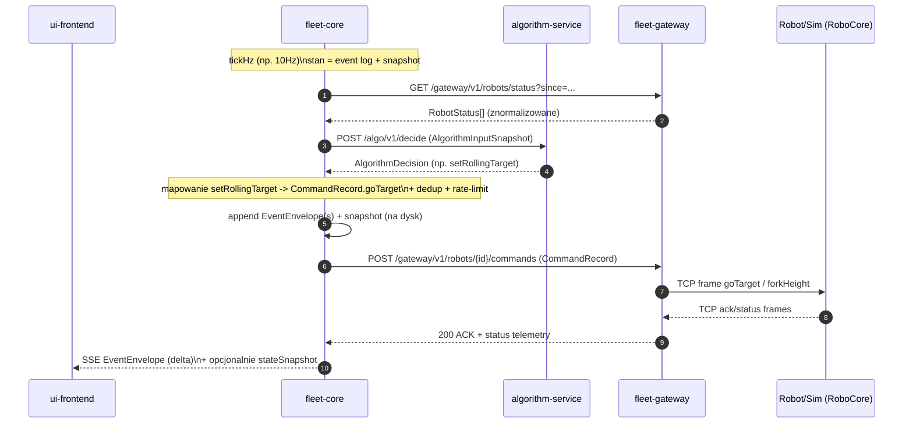
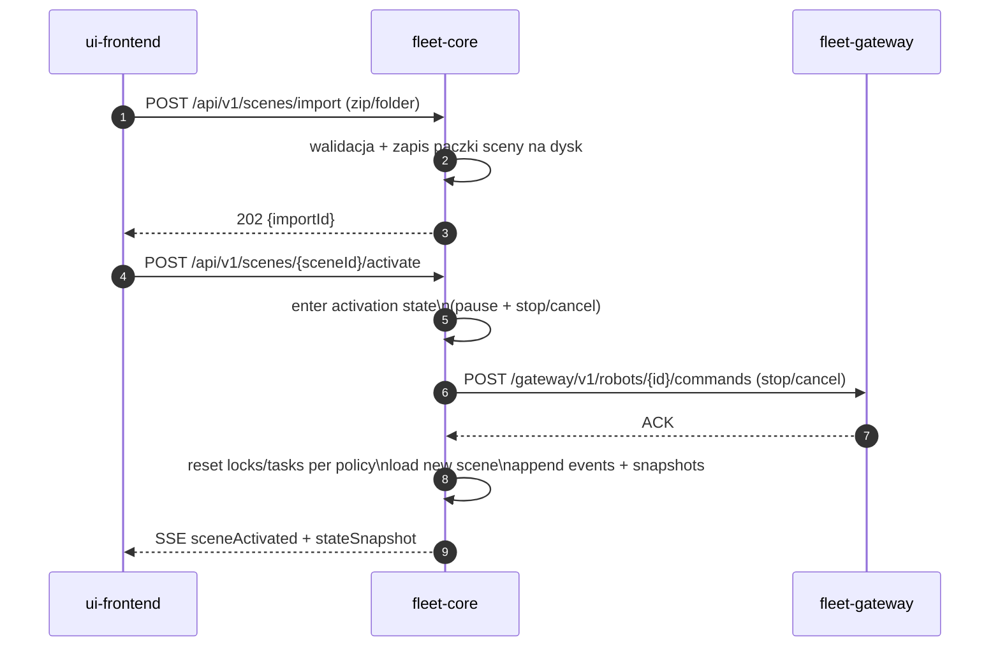
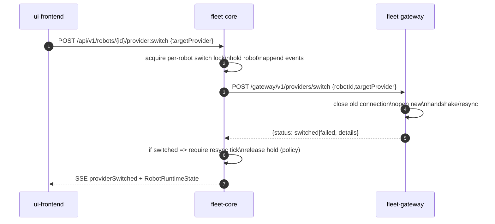

# Fleet Manager 2.0 — Specyfikacja architektury (v0.9, doprecyzowanie API i struktur danych)

**Data:** 2026-01-07  
**Status:** draft „MVP-ready”, wersja porządkująca dokumentację wokół komponentów (bez dalszego dzielenia).

---

## Część 1 — Prompt i cel dokumentu

### Prompt pierwotny (kontekst)
(oryginalny opis problemu i oczekiwań — zachowany, bo jest częścią wymagań)

> Fleet manager to program do zarządzania autonomicznymi wózkami widłowymi.  
> Chcę go przepisać, ale podoba mi się UI.  
> Projekt ma być **bardzo modułowy**, żeby można było pracować nad częściami niezależnie, porozumiewając się przez API.  
> Frontend ma być tylko jednym z klientów — system ma działać headless, ma wspierać wiele frontendów naraz.  
> Ma istnieć silnik/nawigacja, dynamiczna zmiana mapy i konfiguracji (scena).  
> Integracje: Roboshop (upload mapy), RoboCore/Robokit (komunikacja z robotami), wewnętrzna symulacja wielu robotów + możliwość podmiany jednego robota na symulowanego przez RoboCore/Robokit lub na prawdziwego.  
> Wymagane: elegancki design, czytelne interfejsy, odporność na błędy sieci, bardzo profesjonalna dokumentacja.  
> Rolling target: robot dostaje cel „z przodu” na trasie, robot lokalnie planuje.  
> Obstacle avoidance: docelowo po stronie robota, ale w MVP wystarczy wykrywać blokadę i chęć wejścia w tryb omijania.

### Prompt do wersji v0.4 (ten, na podstawie którego powstała aktualizacja)
(zebrane instrukcje i uwagi z recenzji + Twoje doprecyzowania)

> Zastosuj się do wszystkich uwag z recenzji specyfikacji architektury v0.3.  
> Wprowadź ważne zmiany:  
> - Algorytm musi umieć wczytywać geometrię; geometria jest w pliku `.smap` (w `graph.json` jako `DegenerateBezier`).  
> - Robot jest sterowany **rolling target**, ale target to nie (x,y). Target to **LocationMark** albo **ActionPoint**.  
> - Podnoszenie wideł to **ActionPoint** z parametrami (np. z jakiej wysokości na jaką). Opisz jakie ramki protokołu RoboCore/Robokit są do tego użyte.  
> - Wprowadź poprawki wynikające z przeglądu kompletności po podziale na pliki.  
> - Podziel specyfikację na mniejsze dokumenty (np. contracts, core_api, gateway_api, …).

### Prompt do wersji v0.5 (ten, na podstawie którego powstała aktualizacja)
(najważniejsze uwagi z recenzji v0.4 + Twoje doprecyzowania)

> Wykonaj wszystko z recenzji v0.4: przywróć pełny obraz systemu i omówienie KAŻDEGO komponentu.
> Przejrzyj poprzednie wersje i jeśli coś zniknęło, dodaj to z powrotem.
> Dodaj diagramy całości i przepływów.
> Dodaj komponent „robot-controller” do testowego sterowania robotem przez Robokit/RoboCore (na bazie capture z proxy).
> Nie dziel dokumentów dalej (zamiast nowych plików: uzupełnij istniejące, szczególnie 02).

### Prompt do wersji v0.6 (ten, na podstawie którego powstała aktualizacja)
(uwagi z recenzji v0.5 + Twoje doprecyzowania implementacyjne)

> Uwzględnij wszystko z recenzji architektury v0.5.
> - Najpierw doprecyzuj Proxy/Recorder: CLI/config, log layout poza repo, raw bytes w obie strony, warning/rotacja, archiwizacja + manifest.
> - Dodaj plan implementacji MVP komponentami (proxy jako pierwsze).
> - Dodaj scenariusze E2E dla proxy i robot-controller.
> - Doprecyzuj ACK vs DONE (transport ACK, robot ACK, completion).
> - Oznacz w protokole RoboCore/Robokit poziomy pewności i dodaj backlog reverse engineeringu (blokady/avoid/lasery).
> - Przejrzyj poprzednie wersje i jeśli coś zniknęło, dodaj to z powrotem.


---

### Prompt do wersji v0.8 (reorganizacja dokumentacji)
> Słabo mi się podoba zbiór dokumentów: dużo, bełkotliwie, wiedza porozsypywana.  
> Przeorganizuj dokumentację tak, żeby nic nie zginęło.  
> Zorganizuj ją wokół komponentów. Pierwszy dokument to overview całej architektury, kolejne dokumenty opisują komponenty:  
> - fleet-core  
> - fleet-gateway  
> - algorithm-service  
> - ui-frontend  
> - roboshop-bridge  
> - proxy-recorder  
> - robot-controller  
> - robokit-robot-sim  
> - robokit-rds-sim  
> - map-compiler  
> - adapters-robokit  
> Ostatni dokument zawiera pozostałe rzeczy; jeśli coś wypadło, umieść w oddzielnej sekcji.

---

## Część 2 — Jak czytać tę specyfikację

### Kanon i źródła prawdy (ważne!)
Ta specyfikacja jest zorganizowana wokół komponentów, ale nadal trzymamy prostą hierarchię „źródeł prawdy”:

1) **Kontrakty danych i reason codes (Contracts)** — typy, pola, enumy, przykłady payloadów (JSON/JSON5).  
   → sekcje „Kontrakty danych” w plikach komponentów + `99_pozostale.md` (kanon wspólny)

2) **Semantyka runtime (Runtime semantics)** — procedury bezpieczeństwa i maszyny stanów:  
   scene activation, lease/seize control, lifecycle komend, hot-switch providera, retry/timeout.  
   → głównie `01_fleet-core.md`, `02_fleet-gateway.md`, `03_algorithm-service.md` + `99_pozostale.md`

3) **Transport i interfejsy (API/Protocols)** — endpointy HTTP, SSE, framing TCP.  
   → `01_fleet-core.md` (`/api/v1`), `02_fleet-gateway.md` (`/gateway/v1`), `03_algorithm-service.md` (`/algo/v1`),  
   → narzędzia: `06_proxy-recorder.md` (CLI), `07_robot-controller.md` (CLI),  
   → protokół: `10_adapters-robokit.md` (TCP RoboCore/Robokit).

Jeśli implementacja koliduje z opisem, obowiązuje kolejność: **Contracts → Runtime semantics → Transport**.

---

## Struktura plików (v0.9)

1. `00_overview.md` *(ten plik)*
2. `01_fleet-core.md`
3. `02_fleet-gateway.md`
4. `03_algorithm-service.md`
5. `04_ui-frontend.md`
6. `05_roboshop-bridge.md`
7. `06_proxy-recorder.md`
8. `07_robot-controller.md`
9. `08_robokit-robot-sim.md`
10. `08a_robokit-rds-sim.md`
11. `09_map-compiler.md`
12. `10_adapters-robokit.md`
13. `14_map-compiler-visualizer.md`
14. `99_pozostale.md` *(wszystko przekrojowe: kontrakty, semantyka runtime, testy, E2E, MVP, ryzyka, „rzeczy wypadłe”)*

> **Zmiana v0.9:** w dokumentach komponentów dopisano szczegółowe „wejściowe API”, przykłady request/response (JSON5), lokalne struktury danych oraz pobieżne algorytmy działania — spójnie z aktualną specyfikacją algorytmu v0.5.

---

## 1. Cel systemu (MUST)
Fleet Manager steruje flotą autonomicznych wózków widłowych w obrębie **jednej aktywnej sceny** (mapa + konfiguracja), minimalizując ryzyko kolizji i przestojów, przy założeniu, że robot ma własny lokalny planner i może lokalnie omijać przeszkody (docelowo).

W MVP Fleet Manager:
- MUST działać bez frontendu (headless),
- MUST wspierać wiele frontendów równolegle (obserwacja), z wyłącznością sterowania (Control Lease / seize control),
- MUST wspierać symulację wielu robotów (wewnętrzną),
- MUST pozwalać przełączać pojedynczego robota między providerami (internalSim ↔ robokit-robot-sim ↔ real robot),
- MUST wspierać dynamiczną zmianę sceny (import + activation),
- MUST zapewniać pełny audyt/replay: event log + snapshoty na dysk.

## 2. Zasady architektury (MUST)

### 2.1 Domena oddzielona od integracji
- **Fleet Core** = domena + deterministyczna logika + publiczne API + persystencja.
- **Integracje** (roboty, Roboshop, proxy, parsing ramek TCP) są poza domeną i mają cienkie adaptery.

Konsekwencje (MUST):
- Core MUST działać bez UI i bez realnych robotów (np. tylko symulacja / stuby gateway).
- Core MUST być testowalny z mockami gateway i algorytmu.
- Gateway MUST być wymienialny bez zmiany logiki domenowej.

### 2.2 Single-writer w MVP
- Core jest single-writer w MVP (jedna instancja modyfikująca stan).
- Wszystkie mutacje stanu Core MUST przechodzić przez event log.
- Replay MUST odtwarzać identyczny stan dla identycznego event log + tej samej wersji kontraktów.

### 2.3 Wewnątrz systemu: HTTP
- Interfejsy między usługami wewnątrz systemu MUST używać HTTP (REST) + SSE (dla strumienia zdarzeń).
- Wyjątki: zewnętrzne protokoły robotów (RoboCore/Robokit) są TCP i są obsługiwane WYŁĄCZNIE przez warstwę integracji.

## 3. Kanoniczny obraz systemu (diagramy)

### 3.1 Diagram kontekstowy (C4-ish)
```mermaid
flowchart LR
  operator[Operator / UI user] -->|HTTP+SSE| ui[ui-frontend]
  ui -->|HTTP+SSE /api/v1| core[fleet-core]
  core -->|HTTP /algo/v1| algo[algorithm-service]
  core -->|HTTP /gateway/v1| gw[fleet-gateway]
  gw -->|TCP RoboCore/Robokit| robots[Roboty fizyczne]
  gw -->|TCP RoboCore/Robokit| sim[robokit-robot-sim]

  roboshop[Roboshop / RDS] -->|HTTP| bridge[roboshop-bridge]
  bridge -->|uruchamia/wywołuje| compiler[map-compiler]
  bridge -->|import scene (HTTP)| core

  proxy[proxy-recorder] -. podsłuch TCP/HTTP .- robots
  proxy -. podsłuch TCP/HTTP .- roboshop
  proxy -. capture .- sim

  controller[robot-controller (dev/test)] -->|TCP RoboCore/Robokit| robots
  controller -->|TCP RoboCore/Robokit| sim
  controller -->|czyta capture| proxy
```

### 3.2 Diagram kontenerów i interfejsów (MVP)
```mermaid
flowchart TB
  subgraph Clients
    ui[ui-frontend]
    cli[CLI / test harness]
  end

  subgraph Domain
    core[fleet-core\n/api/v1\nSSE /api/v1/events/stream\nevent log + snapshots]
    algo[algorithm-service\n/algo/v1]
  end

  subgraph Integration
    gw[fleet-gateway\n/gateway/v1\nprovider switching]
    bridge[roboshop-bridge]
    compiler[map-compiler]
  end

  subgraph DevTools
    proxy[proxy-recorder]
    controller[robot-controller]
  end

  subgraph External
    robots[Roboty (RoboCore/Robokit TCP)]
    sim[robokit-robot-sim (TCP)]
    roboshop[Roboshop/RDS (HTTP)]
  end

  ui -->|HTTP+SSE| core
  cli -->|HTTP| core
  core -->|HTTP| algo
  core -->|HTTP| gw
  gw -->|TCP| robots
  gw -->|TCP| sim
  bridge -->|HTTP| roboshop
  bridge -->|exec/CLI or HTTP| compiler
  bridge -->|HTTP import| core
  proxy -. intercept .- robots
  proxy -. intercept .- roboshop
  controller -->|TCP| robots
  controller -->|TCP| sim
```

### 3.3 Sekwencja: tick loop (Core → Algo → Core → Gateway → Robot)


### 3.4 Sekwencja: import i aktywacja sceny


### 3.5 Sekwencja: hot-switch providera robota (sym ↔ robokit-robot-sim ↔ real)


## 5. Co jest „MVP-tylko” vs „post-MVP” (krótko)
Pełne MVP: `19_mvp_definicja.md`.

W skrócie (MVP):
- Core + Gateway + Algo + UI (viewer+lease) + internalSim + replay/log/snapshot.
- Roboshop Bridge / proxy-recorder / robot-controller są narzędziami wspierającymi development, ale ich minimalne wersje są bardzo pomocne od początku.

Post-MVP (w tym pliku tylko jako kontekst):
- security, HA, dwukierunkowa synchronizacja z Roboshop, advanced obstacle avoidance.

## 5. Runbook (MVP) — uruchamianie komponentów (AI-friendly)

Cel: żeby można było wprost mówić do AI/Codexa: „uruchom komponent X z configiem Y”, bez interpretacji.

### 5.1 Kontrakt uruchomieniowy usług (MUST)
Każdy komponent uruchamiany jako proces (`fleet-core`, `fleet-gateway`, `algorithm-service`) MUST:
- wspierać flagę `--config <path>` (JSON5),
- wspierać `--print-effective-config` (drukuje wynik merge: defaults + config + env),
- wspierać `--log-level <level>` (np. debug|info|warn|error),
- logować na starcie:
  - effective config,
  - port/host,
  - dataDir,
  - wersję kontraktów (`contractsVersion`).

Jeśli dany komponent ma persystencję, MUST wspierać `--data-dir <path>`.

### 5.2 fleet-core — uruchomienie (MVP)
Kontrakt:
- słucha na `http://0.0.0.0:<corePort>/api/v1`
- trzyma dane w `dataDir` (events+snapshots) na dysku

Przykład:
```bash
fleet-core \
  --config ./configs/fleet-core.local.json5 \
  --data-dir ./var/core \
  --print-effective-config
```

### 5.3 fleet-gateway — uruchomienie (MVP)
Kontrakt:
- słucha na `http://0.0.0.0:<gatewayPort>/gateway/v1`
- ma skonfigurowane roboty i providery (internalSim/robokitSim/robocore)
- (debug) ma `captureDir` na dysk

Przykład:
```bash
fleet-gateway \
  --config ./configs/fleet-gateway.local.json5 \
  --print-effective-config
```

### 5.4 algorithm-service — uruchomienie (MVP)
Kontrakt:
- słucha na `http://0.0.0.0:<algoPort>/algo/v1`
- jest side-effect free (bez pisania do core)

Przykład:
```bash
algorithm-service --config ./configs/algo.local.json5 --print-effective-config
```

### 5.5 ui-frontend — uruchomienie (MVP)
UI to web app; MUST dać się skonfigurować przez:
- `CORE_BASE_URL` (np. `http://localhost:8080/api/v1`)
- `SSE_URL` (np. `http://localhost:8080/api/v1/events`)

Przykład:
```bash
ui-frontend --core-url http://localhost:8080/api/v1
```

### 5.6 proxy-recorder — uruchomienie (MVP-dev)
Patrz: `06_proxy-recorder.md` (ten pakiet).

### 5.7 robot-controller — uruchomienie (MVP-dev)
Kontrakt:
- potrafi łączyć się do robota/sima (direct lub przez proxy),
- potrafi wykonać smoke sekwencję,
- loguje na dysk.

Przykład:
```bash
robot-controller smoke \
  --robot-id RB-01 \
  --host 127.0.0.1 \
  --task-port 29206 \
  --other-port 29210 \
  --ctrl-port 29205
```

### 5.8 full stack lokalnie (SHOULD)
Minimalnie:
1) uruchom `robokit-robot-sim` (jeśli używane),
2) uruchom `fleet-gateway`,
3) uruchom `algorithm-service`,
4) uruchom `fleet-core`,
5) uruchom `ui-frontend` (opcjonalnie).

W CI rekomendowane jest `docker compose` (post-MVP dopracujemy), ale kontrakt uruchomieniowy MUST pozostać stabilny.
